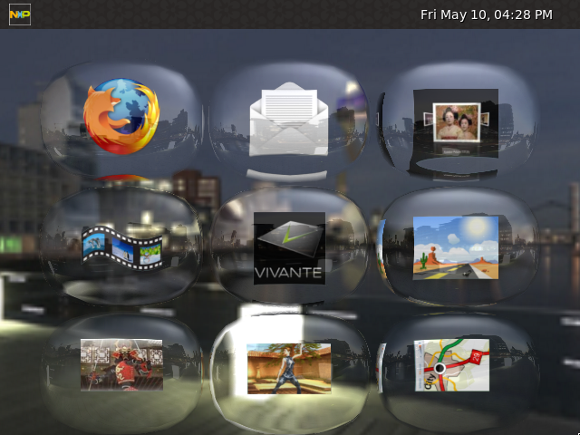
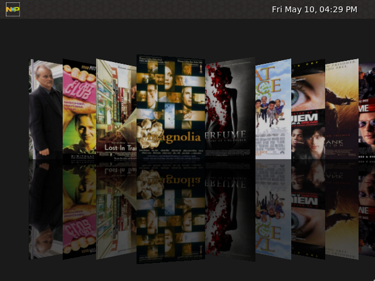
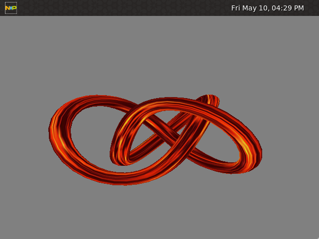
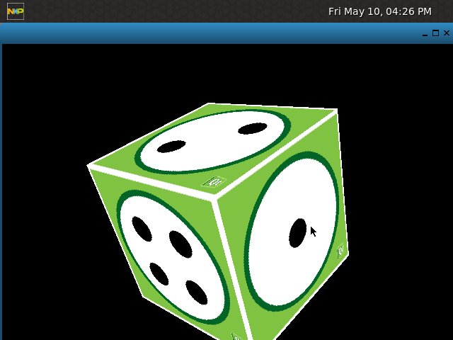
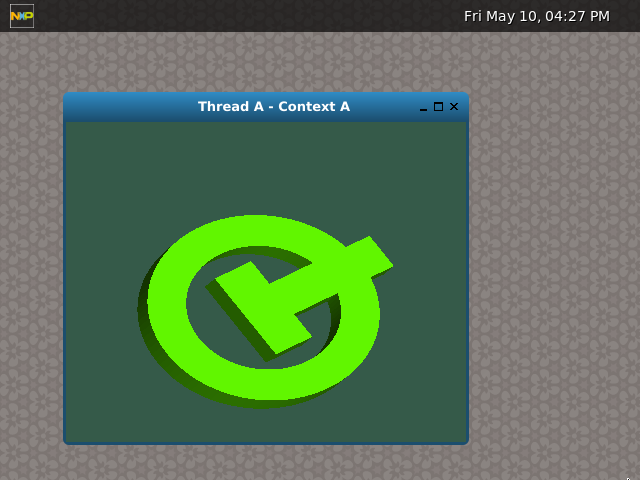
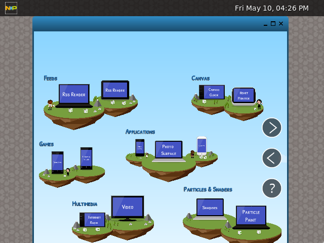
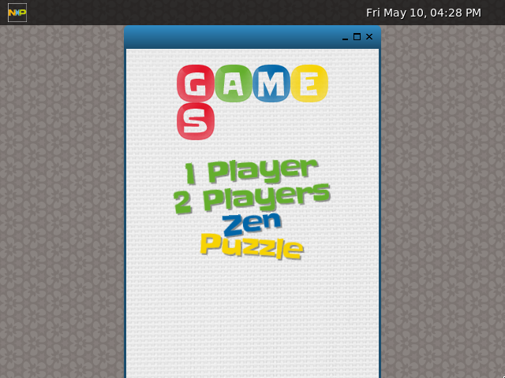
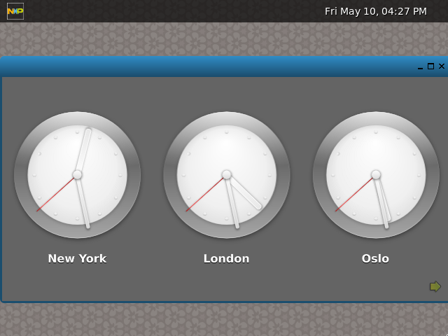

# NXP Demo Experience Demo List

## Introduction

This page describes all the demos supported by the [NXP Demo Experience](https://source.codeaurora.org/external/imxsupport/nxp-demo-experience). The user can modify the JSON file to set the demos according to its requirements. 

## Install
> **Note:** This assumes that there is an installation of the NXP Demo Experience on the target board  

First, download this repository **to your local machine**.

    git clone https://source.codeaurora.org/external/imxsupport/nxp-demo-experience-demos-list.git

Next, remove the existing demo list **on the board**.

    rm -r /home/root/.nxp-demo-experience/*

Last, copy the new demo list files to the board **from the local machine**.

    scp -r nxp-demo-experience-demos-list root@<Board's IP Address>:/home/root/.nxp-demo-experience

## How to Add a New Demo

To add a new demo to the NXP Demo Experience, add an entry to the demos.json file. The following are the elements of an entry:

* name: Name of the demo.
* executable: Executable command to launch de demo.
* source: Link to the source code. (**optional**)
* icon: Icon file to represent the demo. (**optional**)
* screenshot: Screenshot file of the demo. (**optional**)
* compatible: List of compatible boards.
* description: Description of the demo.

> **Important**: All the demos must be inside 2 categories, in the example below, `Camera Preview` is inside `Multimedia` and `Video4Linux2` categories.

Example:

    {"demos":[{
      "multimedia":[{
        "Video4Linux2":[{
          "name": "Camera Preview",
          "executable": "/unittests/v4l2/mxc_v4l2_capture",
          "source": "https://source.codeaurora.org/external/imx/imx-test/tree/test/mxc_v4l2_test/mxc_v4l2_capture.c?h=imx_4.14.98_2.0.0_ga",
          "icon": "v4l2_cam_prev_icon.png",
          "screenshot": "v4l2_cam_prev_screenshot.png",
          "compatible": "imx7ulpevk, imx8qmmek",
          "description": "Description of v4l2 camera preview"
        }] 
      }]
    }]}

Upload the screenshots and icons inside the `screenshot` and `icon` folders. New executables can be included in the `scripts` folder. If including a script, ensure that that `executable` field reads `/home/root/.nxp-demo-experience/scripts/<script location>`
      

After adding the new demo, you can check if the new entry is in a valid JSON format by copying the entire file text and pasting on the site: **http://json.parser.online.fr/**

## Supported Demo List

Below is a list of demos that come on the default installalation of the NXP Demo Experience. To see what boards support the NXP Demo Expereince, please see the [README on the build layer](https://source.codeaurora.org/external/imxsupport/meta-nxp-demo-experience/tree/README).

### Multimedia

#### GStreamer - Video test source
*Compatible with imx7ulpevk imx8qxpc0mek, imx8qmmek, imx8mqevk, imx8mmevk, imx8mnevk, and imx8mpevk*

This is a simple GStreamer pipeline able to play the Video Test Source example.

#### GStreamer - Camera Preview
*Compatible with imx8qxpc0mek, imx8qmmek, imx8mqevk, imx8mmevk, imx8mnevk, and imx8mpevk*

This is a simple GStreamer pipeline able to create a camera preview example. Note that this example only works with the correct DTS file and needs a IMXTOCSI acessory connected to the board.

#### GStreamer - Camera using VPU
*Compatible with imx8mpevk*

This is a GStreamer pipeline able to create a camera preview example using VPU to encode and decode the image.

#### GStreamer - Multi Cameras Preview
*Compatible with imx8mpevk*

This is a GStreamer pipeline able to create a camera preview example using a Basler camera and an OV5640 camera simultaneously.

#### Audio - Audio Record
*Compatible with imx7ulpevk*

This test records an audio file from Headphone input with a 10 second duration. Make sure a Headphone is connected to the board.

#### Audio - Audio Play
*Compatible with imx7ulpevk*

This test plays the audio file recorded on the 'Audio Record' test. Make sure a Headphone is connected to the board. Need to run the 'Audio Record' test first.

### GPU

#### OpenVG 2D - Tiger G2D
*Compatible with imx7ulpevk, imx8mqevk, imx8mmevk, imx8mnevk, imx8qxpc0mek, imx8qmmek, and imx8mpevk*

Vivante Tiger G2D, this demo shows a vector image being rotated and scaled using OpenVG.

#### GLES2 - Vivante Launcher
*Compatible with imx7ulpevk, imx8qxpc0mek, imx8qmmek, and imx8mpevk*

Displays the Vivante launcher demo.

#### GLES2 - Cover Flow
*Compatible with imx7ulpevk*

Displays the Vivante Cover Flow demo.

#### GLES2 - Vivante Tutorial
*Compatible with imx7ulpevk*

Displays the Vivante OpenGL tutorial.

#### GLES2 - Bloom
*Compatible with imx7ulpevk, imx8mqevk, imx8mmevk, imx8mnevk, imx8qxpc0mek, imx8qmmek, and imx8mpevk*

An example of how to create a bloom effect. The idea is not to create the most accurate bloom, but something that is fairly fast to render. Instead of increasing the kernal size to get a good blur we do a fairly fast approximation by downscaling the original image to multiple smaller render-targets and then blurring these using a relative small kernel and then finally rescaling the result to the original size.

*Source: https://source.codeaurora.org/external/imx/cafatgithub/gtec-demo-framework/tree/DemoApps/GLES2/Bloom*

#### GLES2 - Blur
*Compatible with imx7ulpevk, imx8mqevk, imx8mmevk, imx8mnevk, imx8qxpc0mek, imx8qmmek, and imx8mpevk*

Uses the two pass linear technique and further reduces the bandwidth requirement by downscaling the 'source image' to 1/4 its size (1/2w x 1/2h) before applying the blur and and then upscaling the blurred image to provide the final image. This works well for large kernel sizes and relatively high sigma's but the downscaling produces visible artifacts with low sigma's.

*Source: https://source.codeaurora.org/external/imx/cafatgithub/gtec-demo-framework/tree/DemoApps/GLES2/Blur*

#### GLES2 - DFGraphicsBasic2D
*Compatible with imx7ulpevk, imx8mqevk, imx8mmevk, imx8mnevk, imx8qxpc0mek, imx8qmmek, and imx8mpevk*

Shows how to use the Demo Frameworks 'basic' 2d rendering capabilities that work across all backends. The basic2D interface allows you to render ASCII strings using a system provided font and draw colored points in batches. The functionality in Basic2D is used internally in the framework to render the profiling overlays like the frame rate counter and graphs.

*Source: https://source.codeaurora.org/external/imx/cafatgithub/gtec-demo-framework/tree/DemoApps/GLES2/DFGraphicsBasic2D*

#### GLES2 - DFSimpleUI100
*Compatible with imx7ulpevk, imx8mqevk, imx8mmevk, imx8mnevk, imx8qxpc0mek, imx8qmmek, and imx8mpevk*

A very basic example of how to utilize the DemoFramework's UI library. The sample displays four buttons and reacts to clicks. The UI framework that makes it easy to get a basic UI up and running. The main UI code is API independent. It is not a show case of how to render a UI fast but only intended to allow you to quickly get a UI ready that is good enough for a demo.

*Source: https://source.codeaurora.org/external/imx/cafatgithub/gtec-demo-framework/tree/DemoApps/GLES2/DFSimpleUI100*

#### GLES2 - EightLayerBlend
*Compatible with imx7ulpevk, imx8mqevk, imx8mmevk, imx8mnevk, imx8qxpc0mek, imx8qmmek, and imx8mpevk*

Creates a simple parallax scrolling effect by blending eight 32 bit per pixel 1080p layers on top of each other. This is not the most optimal way to do it as it uses eight passes. But it does provide a good example of the worst case bandwidth use for the operation. The demo was created to compare GLES to the G2D eight blend blit functionality.

*Source: https://source.codeaurora.org/external/imx/cafatgithub/gtec-demo-framework/tree/DemoApps/GLES2/EightLayerBlend*

#### GLES2 - FractalShader
*Compatible with imx7ulpevk, imx8mqevk, imx8mmevk, imx8mnevk, imx8qxpc0mek, imx8qmmek, and imx8mpevk*

Can render both the julia and mandelbrot set using a fragment shader. This demo was used to demonstrates GPU shader performance by using up roughly 515 instructions to render each fragment while generating the julia set. It uses no textures, has no overdraw and has a minimal bandwidth requirement.

*Source: https://source.codeaurora.org/external/imx/cafatgithub/gtec-demo-framework/tree/DemoApps/GLES2/FractalShader*

#### GLES2 - LineBuilder101
*Compatible with imx7ulpevk, imx8mqevk, imx8mmevk, imx8mnevk, imx8qxpc0mek, imx8qmmek, and imx8mpevk*

A simple example of dynamic line rendering using the LineBuilder helper class. The line builder has 'Add' methods for most FslBase.Math classes like BoundingBox, BoundingSphere, BoundingFrustrum, Ray, etc.

*Source: https://source.codeaurora.org/external/imx/cafatgithub/gtec-demo-framework/tree/DemoApps/GLES2/LineBuilder101*

#### GLES2 - Model Loader
*Compatible with imx7ulpevk, imx8mqevk, imx8mmevk, imx8mnevk, imx8qxpc0mek, imx8qmmek, and imx8mpevk*

Demonstrates how to use the FslSceneImporter and Assimp to load a scene and render it using OpenGLES2. The model is rendered using a simple per pixel directional light shader.

*Source: https://source.codeaurora.org/external/imx/cafatgithub/gtec-demo-framework/tree/DemoApps/GLES2/ModelLoaderBasics*

#### GLES2 - S03_Transform
*Compatible with imx7ulpevk, imx8mqevk, imx8mmevk, imx8mnevk, imx8qxpc0mek, imx8qmmek, and imx8mpevk*

Renders a animated vertex colored triangle. This shows how to modify the model matrix to rotate a triangle and how to utilize demoTime.DeltaTime to do frame rate independent animation.

*Source: https://source.codeaurora.org/external/imx/cafatgithub/gtec-demo-framework/tree/DemoApps/GLES2/S03_Transform*

#### GLES2 - S04_Projection
*Compatible with imx7ulpevk, imx8mqevk, imx8mmevk, imx8mnevk, imx8qxpc0mek, imx8qmmek, and imx8mpevk*

This example shows how to: - Build a perspective projection matrix - Render two simple 3d models using frame rate independent animation.

*Source: https://source.codeaurora.org/external/imx/cafatgithub/gtec-demo-framework/tree/DemoApps/GLES2/S04_Projection*

#### GLES2 - S06_Texturing
*Compatible with imx7ulpevk, imx8mqevk, imx8mmevk, imx8mnevk, imx8qxpc0mek, imx8qmmek, and imx8mpevk*

This example shows how to use the Texture class to use a texture in a cube. It also shows you how to use the ContentManager service to load a 'png' file from the Content directory into a bitmap utility class which is then used to used to create a OpenGL ES texture.

*Source: https://source.codeaurora.org/external/imx/cafatgithub/gtec-demo-framework/tree/DemoApps/GLES2/S06_Texturing*

#### GLES2 - Mapping
*Compatible with imx7ulpevk, imx8mqevk, imx8mmevk, imx8mnevk, imx8qxpc0mek, imx8qmmek, and imx8mpevk*

This sample shows how to use a cubemap texture to simulate a reflective material. It also shows you how to use the ContentManager service to load a 'dds' file from the Content directory into a Texture utility class which is then used to used to create a OpenGL ES cubemap texture.

*Source: https://source.codeaurora.org/external/imx/cafatgithub/gtec-demo-framework/tree/DemoApps/GLES2/S07_EnvironmentMapping*

#### GLES2 - Mapping Refraction
*Compatible with imx7ulpevk, imx8mqevk, imx8mmevk, imx8mnevk, imx8qxpc0mek, imx8qmmek, and imx8mpevk*

This sample is a variation from the previous sample, again, a cubemap texture is used, but this time instead of simulating a reflective material a refractive material is simulated. It also shows you how to use the ContentManager service to load a 'dds' file from the Content directory into a Texture utility class which is then used to used to create a OpenGL ES cubemap texture.

*Source: https://source.codeaurora.org/external/imx/cafatgithub/gtec-demo-framework/tree/DemoApps/GLES2/S08_EnvironmentMappingRefraction*

### QT5

#### OpenGL - Qt5 Cube
*Compatible with imx7ulpevk*

The Cube OpenGL ES 2.0 example shows how to write mouse rotateable textured 3D cube using OpenGL ES 2.0 with Qt. It shows how to handle polygon geometries efficiently and how to write simple vertex and fragment shader for programmable graphics pipeline. In addition it shows how to use quaternions for representing 3D object orientation.

*Source: https://doc.qt.io/qt-5/qtopengl-cube-example.html*

#### OpenGL - Q5 Hello GL2
*Compatible with imx7ulpevk*

The Hello GL2 example demonstrates the basic use of the OpenGL-related classes provided with Qt.

*Source: https://doc.qt.io/qt-5/qtopengl-hellogl2-example.html*

#### Qt Quick - QT5 Everywhere
*Compatible with imx7ulpevk*

Displays the QT5 Demo Launcher

*Source: https://code.qt.io/cgit/qt-labs/qt5-everywhere-demo.git/*

#### Qt Quick - Same Game
*Compatible with imx7ulpevk*

A QML implementation of the popular puzzle game by Kuniaki Moribe. Same Game demonstrates a QML game with custom types and logic written in JavaScript. The game uses various Qt Quick features such as particles, animation, and loading images.

*Source: https://doc.qt.io/qt-5/qtdoc-demos-samegame-example.html*

#### Qt Quick - QT5 Clocks
*Compatible with imx7ulpevk*

A QML clock application that demonstrates using a ListView type to display data generated by a ListModel and a SpringAnimation type to animate images.

*Source: https://doc.qt.io/qt-5/qtdoc-demos-clocks-example.html*

### Machine Learning
#### pyeIQ - Switch Image
*Compatible with imx8mpevk*

A object classification application whose inference can be done either by the CPU ou the NPU to compare the performance of each core.

*Source: https://source.codeaurora.org/external/imxsupport/pyeiq/tree/eiq/apps/label*
