## i.MX Demo Launcher - Demo List

### Table of Contents

* [Introduction](#markdown-header-introduction)
* [How to Add a New Demo](#markdown-header-how-to-add-a-new-demo)
* [Application Resolution](#markdown-header-application-resolution)
* [Supported Devices](#markdown-header-supported-devices)
* [Supported Demo List](#markdown-header-supported-demo-list)
  * [Multimedia](#markdown-header-multimedia)
    * [GStreamer](#markdown-header-gstreamer)
  * [GPU](#markdown-header-gpu)
    * [OpenVG 2D](#markdown-header-openvg-2d)
    * [GLES2](#markdown-header-gles2)
  * [Audio](#markdown-header-audio)
    * [Audio Playback](#markdown-header-audio-playback)

### Introduction

This page describes all the demos supported by the [i.MX Demo Launcher][demo_launcher]. The user can modify the JSON file to set the demos according to its requirements.

#### Project bitbucket page:

https://bitbucket.sw.nxp.com/projects/IMXS/repos/imx-demo-launcher-demos-list/browse

#### Download:

git clone https://bitbucket.sw.nxp.com/scm/imxs/imx-demo-launcher-demos-list.git

### How to Add a New Demo

Add the new demo on file demos.json.

* name: Name of the demo.
* executable: Executable command to launch de demo.
* source: Link to the source code. (**optional**)
* icon: Icon file to represent the demo. (**optional**)
* screenshot: Screenshot file of the demo. (**optional**)
* compatible: List of compatible boards.
* description: Description of the demo.

**Important**: All the demos must be inside 2 categories, in the example below, "Camera Preview" is inside Multimedia and Video4Linux2 categories.

Upload the screenshots and icons inside the "screenshot" and "icon" folders.
Example:

    "multimedia":[{
        "Video4Linux2":[{
            "name": "Camera Preview",
            "executable": "/unittests/v4l2/mxc_v4l2_capture",
            "source": "https://source.codeaurora.org/external/imx/imx-test/tree/test/mxc_v4l2_test/mxc_v4l2_capture.c?h=imx_4.14.98_2.0.0_ga",
            "icon": "v4l2_cam_prev_icon.png",
            "screenshot": "v4l2_cam_prev_screenshot.png",
            "compatible": "imx7ulpevk, imx8qmmek",
            "description": "Description of v4l2 camera preview" }]

After adding the new demo, you can check if the new entry is in a valid JSON format by copying the entire file text and pasting on the site: **http://json.parser.online.fr/**

### Application Resolution

The i.MX Demo Launcher was designed to support HD resolution (1280x720). However, the i.MX 7ULP EVK only
supports 640x480 resolution. So, by default, when the user runs the application, it checks the resolution
and if it is less then HD, the Demo Launcher will be opened in 640x480.

### Supported Devices

* imx7ulpevk
* imx8qxpmek
* imx8mmevk

### Supported Demo List

### Multimedia

#### GStreamer

##### Gstreamer Video Test Source

This is a simple GStreamer pipeline able to play the Video Test Source example. Check the pipelines used in this test below:
For i.MX 7ULP EVK:
```
gst-launch-1.0 videotestsrc ! imxvideoconvert_g2d ! waylandsink window-width=480 window-height=360
```
For i.MX 8:
```
gst-launch-1.0 videotestsrc ! video/x-raw, width=1280,height=720 ! glimagesink
```

##### GStreamer Video Playback

This is GStreamer playback example, which reproduces a HD video though a H.264 decode process:
```
gst-launch-1.0 filesrc location=file.mp4 ! decodebin ! imxvideoconvert_g2d ! glimagesink
```

##### GStreamer Camera Preview

This is a simple GStreamer pipeline able to create a camera preview example. Note that this example only works with the correct DTS file and needs a IMXTOCSI acessory connected to the board.
```
gst-launch-1.0 v4l2src device=/dev/video0 ! video/x-raw,width=1280,height=720 ! queue ! glimagesink
```

### GPU

#### OpenVG 2D

##### Tiger G2D

Description of Vivante Tiger G2D

##### GPU Unit Test

Description of GPU Unit Test

#### GLES2

##### [Bloom][bloom]

<a>
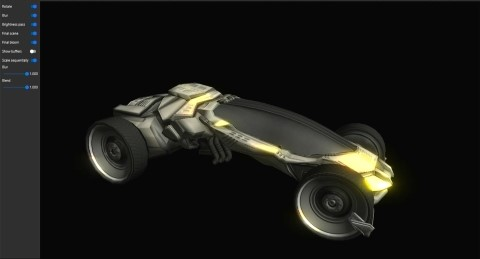
</a>

An example of how to create a bloom effect. The idea is not to create the most accurate bloom, but something that is fairly fast to render. Instead of increasing the kernal size to get a good blur we do a fairly fast approximation by downscaling the original image to multiple smaller render-targets and then blurring these using a relative small kernel and then finally rescaling the result to the original size.

##### [Blur][blur]

<a>
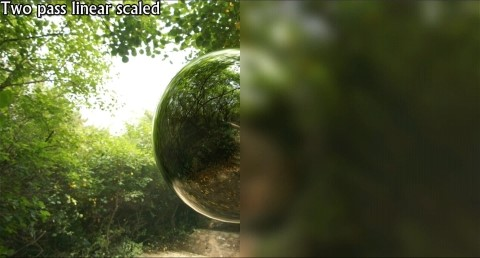
</a>

Uses the two pass linear technique and further reduces the bandwidth requirement by downscaling the 'source image' to 1/4 its size (1/2w x 1/2h) before applying the blur and and then upscaling the blurred image to provide the final image. This works well for large kernel sizes and relatively high sigma's but the downscaling produces visible artifacts with low sigma's.

##### [DFGraphicsBasic2D][dfgraphicsbasic2d]

<a>

</a>

Shows how to use the Demo Frameworks 'basic' 2d rendering capabilities that work across all backends. The basic2D nterface allows you to render ASCII strings using a system provided font and draw colored points in batches. The functionality in Basic2D is used internally in the framework to render the profiling overlays like the frame rate counter and graphs.

##### [DFSimpleUI100][dfsimpleui100]

<a>

</a>

A very basic example of how to utilize the DemoFramework's UI library. The sample displays four buttons and reacts to clicks. The UI framework that makes it easy to get a basic UI up and running. The main UI code is API independent. It is not a show case of how to render a UI fast but only intended to allow you to quickly get a UI ready that is good enough for a demo.

##### [EightLayerBlend][eightlayerblend]

<a>
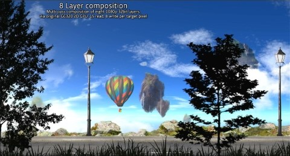
</a>

Creates a simple parallax scrolling effect by blending eight 32 bit per pixel 1080p layers on top of each other. This is not the most optimal way to do it as it uses eight passes. But it does provide a good example of the worst case bandwidth use for the operation. The demo was created to compare GLES to the G2D eight blend blit functionality.

##### [FractalShader][fractalshader]

<a>
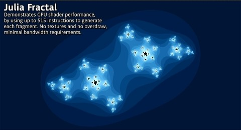
</a>

Can render both the julia and mandelbrot set using a fragment shader. This demo was used to demonstrates GPU shader performance by using up roughly 515 instructions to render each fragment while generating the julia set. It uses no textures, has no overdraw and has a minimal bandwidth requirement.

##### [LineBuilder101][linebuilder101]

<a>
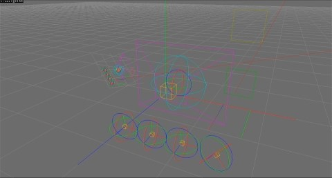
</a>

A simple example of dynamic line rendering using the LineBuilder helper class. The line builder has 'Add' methods for most FslBase.Math classes like BoundingBox, BoundingSphere, BoundingFrustrum, Ray, etc.

##### [ModelLoaderBasics][modelloaderbasics]

<a>
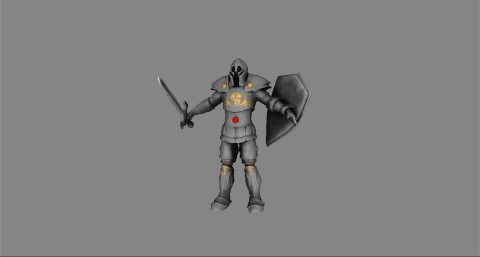
</a>

Demonstrates how to use the FslSceneImporter and Assimp to load a scene and render it using OpenGLES2. The model is rendered using a simple per pixel directional light shader.

##### [S03_Transform][s03_transform]

<a>
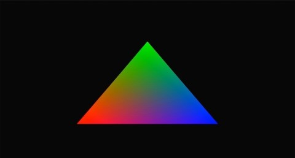
</a>

Renders a animated vertex colored triangle. This shows how to modify the model matrix to rotate a triangle and how to utilize demoTime.DeltaTime to do frame rate independent animation.

##### [S04_Projection][s04_projection]

<a>
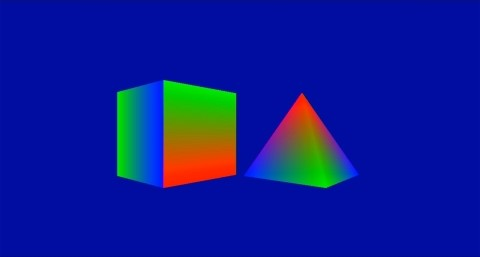
</a>

This example shows how to: - Build a perspective projection matrix - Render two simple 3d models using frame rate independent animation.

##### [S06_Texturing][s06_texturing]

<a>
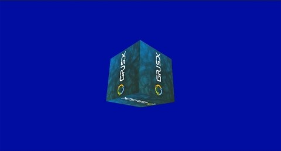
</a>

This example shows how to use the Texture class to use a texture in a cube. It also shows you how to use the ContentManager service to load a 'png' file from the Content directory into a bitmap utility class which is then used to used to create a OpenGL ES texture.

##### [S07_EnvironmentMapping][s07_environmentmapping]

<a>
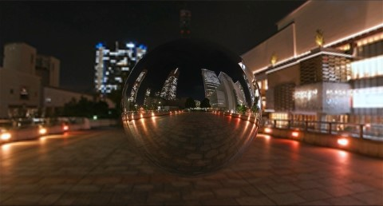
</a>

This sample shows how to use a cubemap texture to simulate a reflective material. It also shows you how to use the ContentManager service to load a 'dds' file from the Content directory into a Texture utility class which is then used to used to create a OpenGL ES cubemap texture.

##### [S08_EnvironmentMappingRefraction][s08_environmentmappingrefraction]

<a>
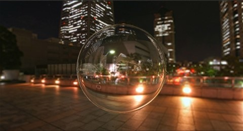
</a>

This sample is a variation from the previous sample, again, a cubemap texture is used, but this time instead of simulating a reflective material a refractive material is simulated. It also shows you how to use the ContentManager service to load a 'dds' file from the Content directory into a Texture utility class which is then used to used to create a OpenGL ES cubemap texture.


### Audio

#### Audio Playback

##### Audio Record

This test records an audio file from Headphone input with a 10 second duration. Make sure a Headphone is connected to the board.

##### Audio Play

This test plays the audio file recorded on the 'Audio Record' test. Make sure a Headphone is connected to the board. Need to run the 'Audio Record' test first.

[demo_launcher]: https://bitbucket.sw.nxp.com/projects/IMXS/repos/i.mx-demo-launcher/browse
[bloom]: https://source.codeaurora.org/external/imx/cafatgithub/gtec-demo-framework/tree/DemoApps/GLES2/Bloom?h=5.3.0
[blur]: https://source.codeaurora.org/external/imx/cafatgithub/gtec-demo-framework/tree/DemoApps/GLES2/Blur?h=5.3.0
[DFGraphicsBasic2D]: https://source.codeaurora.org/external/imx/cafatgithub/gtec-demo-framework/tree/DemoApps/GLES2/DFGraphicsBasic2D?h=5.3.0
[dfsimpleui100]: https://source.codeaurora.org/external/imx/cafatgithub/gtec-demo-framework/tree/DemoApps/GLES2/DFSimpleUI100?h=5.3.0
[eightlayerblend]: https://source.codeaurora.org/external/imx/cafatgithub/gtec-demo-framework/tree/DemoApps/GLES2/EightLayerBlend?h=5.3.0
[fractalshader]: https://source.codeaurora.org/external/imx/cafatgithub/gtec-demo-framework/tree/DemoApps/GLES2/FractalShader?h=5.3.0
[linebuilder101]: https://source.codeaurora.org/external/imx/cafatgithub/gtec-demo-framework/tree/DemoApps/GLES2/LineBuilder101?h=5.3.0
[modelloaderbasics]: https://source.codeaurora.org/external/imx/cafatgithub/gtec-demo-framework/tree/DemoApps/GLES2/ModelLoaderBasics?h=5.3.0
[s03_transform]: https://source.codeaurora.org/external/imx/cafatgithub/gtec-demo-framework/tree/DemoApps/GLES2/S03_Transform?h=5.3.0
[s04_projection]: https://source.codeaurora.org/external/imx/cafatgithub/gtec-demo-framework/tree/DemoApps/GLES2/S04_Projection?h=5.3.0
[s06_texturing]: https://source.codeaurora.org/external/imx/cafatgithub/gtec-demo-framework/tree/DemoApps/GLES2/S06_Texturing?h=5.3.0
[s07_environmentmapping]: https://source.codeaurora.org/external/imx/cafatgithub/gtec-demo-framework/tree/DemoApps/GLES2/S07_EnvironmentMapping?h=5.3.0
[s08_environmentmappingrefraction]: https://source.codeaurora.org/external/imx/cafatgithub/gtec-demo-framework/tree/DemoApps/GLES2/S08_EnvironmentMappingRefraction?h=5.3.0
