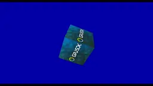

# GoPoint for i.MX Applications Processors - Example Applications Package

## GoPoint for i.MX Applications Processors

> **NOTE:** The NXP Demo Experience is now GoPoint for i.MX Applications Processors.

NXP's *GoPoint for i.MX Applications Processors* unlocks a world of possibilities. This user-friendly app launches
pre-built applications packed with the Linux BSP, giving you hands-on experience with your i.MX SoC's capabilities.
It is for the ones who are interested in showcasing various features and capabilities of the SoCs provided by NXP.
The application examples included in GoPoint are meant to be easy to run for users of all skill levels,
making complex use cases accessible to anyone. Users might need some basic knowledge when it comes to setting up
equipment on Evaluation Kits (EVKs), such as changing Device Tree Blob (DTB) files.

For more information about GoPoint, please refer to
[GoPoint for i.MX Applications Processors User's Guide](https://www.nxp.com/docs/en/user-guide/GPNTUG.pdf).

## GoPoint for i.MX Applications Processors - Example Applications Package

This repository contains example applications supported by [GoPoint for i.MX Applications Processors](https://github.com/nxp-imx-support/nxp-demo-experience).

## Machine Learning

Name  | Description | 8MM   | 8QM   | 8MP   | 93    | 95
:---: | :---        | :---: | :---: | :---: | :---: | :---:
 Image classification | Image classification example using NNStreamer. Image classification is an ML task that attempts to comprehend an entire image as a whole. The goal is to classify the image by assigning it to a specific label. Typically, it refers to images in which only one object appears and is analyzed. | :white_check_mark: | :white_check_mark: | :white_check_mark: | :white_check_mark: | :white_check_mark:
 Object detection | Object detection example using NNStreamer. Object detection is the ML task that detects instances of objects of a certain class within an image. A bounding box and a class label are found for each detected object. | :white_check_mark: | :white_check_mark: | :white_check_mark: | :white_check_mark: | :white_check_mark:
 Pose estimation | Pose estimation example using NNStreamer. The goal of pose estimation is to detect the position and orientation of a person or object. In human pose estimation, this is usually done with specific keypoints such as hands, head, legs, etc. | | :white_check_mark: | :white_check_mark: | | :white_check_mark:
 ML Benchmark | This tool allows to easily compare the performance of TensorFlow Lite models running on CPU (Cortex-A) and NPU. The tool works on i.MX93 and i.MX8M Plus. | | | :white_check_mark: | :white_check_mark: |
 [ML Gateway](./scripts/machine_learning/ml_gateway) | ML Gateway easily configures the i.MX8M Plus and i.MX93 EVKs as machine learning accelerator servers and allows resource-constrained MPU systems (clients) without NPUs to connect and run ML inference. This is currently enabled for i.MX8M Mini on the client side. | :white_check_mark: | | :white_check_mark: | :white_check_mark: |
 [Selfie Segmenter](./scripts/machine_learning/selfie_segmenter/) | Selfie Segmenter showcases the ML capabilities of i.MX8M Plus and i.MX93 by using the NPU to accelerate an instance segmentation model. This model lets you segment the portrait of a person and can be used to replace or modify the background of an image. | | | :white_check_mark: | :white_check_mark: |
 [i.MX Smart Fitness](./scripts/machine_learning/imx_smart_fitness/) | i.MX Smart Fitness showcases the i.MX' Machine Learning capabilities by using an NPU to accelerate two Deep Learning vision-based models. Together, these models detect a person present in the scene and predict 33 3D-keypoints to generate a complete body landmark, known as pose estimation. From the pose estimation, a K-NN pose classifier classifies two different body poses: 'Squat-Down' and 'Squat-Up'. The application tracks the 'squats' fitness exercise and the repetition counter is set to 12 repetitions in an infinite loop. | | | :white_check_mark: | :white_check_mark: |
 Face Recognition | An OpenCV application example of how to use machine learning to recognize faces. The user can save multiple profiles and the application will recognize the identity of each person by their names. | | | :white_check_mark: | |
 [Driving Monitoring System (DMS)](./scripts/machine_learning/dms/)  | An example over how to implement a Driver Monitoring System (DMS) using the NPU. | | | :white_check_mark: | :white_check_mark: | |
 [Low Power Baby Cry Detection](./scripts/machine_learning/low_power_ml/) | An application example showing how to implement baby cry detection in Cortex-M33 core when Linux is in suspend mode. When the application is started, Linux enters suspend mode, and users must enter the timeout value in Cortex-M33 console. Then Cortex-M33 records one second audio input from MIC array on the i.MX93 EVK board, and try to identify whether there is baby crying sound in the audio by running ML model inference. If baby crying sound is detected, it will wake up Cortex-A55 core and stop. If baby crying sound is not detected, it will suspend Cortex-M33 core for the configured timeout and wake up Cortex-M33 core to record one second audio again, and run the same process in an infinite loop until a baby crying sound is detected. | | | | :white_check_mark: | |
 [Low Power KWS Detection](./scripts/machine_learning/low_power_ml/) | An application example showing how to implement key word detection in Cortex-M33 core when Linux is in suspend mode. When the application is started, Linux enters suspend mode. Cortex-M33 will record one second audio input from MIC array on the i.MX93 EVK board, and try to identify whether there is key word `UP` in the audio by running ML model inference. If key word is detected, it will wake up Cortex-A55 core and stop. If no key word is detected, it will record one second audio again, and run the same process in an infinite loop until a key word is detected. | | | | :white_check_mark: | |

## Multimedia

Name  | Description | 7ULP  | 8MN   | 8MM   | 8MQ   | 8QM   | 8QXP  | 8MP   | 8ULP  | 93
:---: | :---        | :---: | :---: | :---: | :---: | :---: | :---: | :---: | :---: | :---:
 Video Test | This is a simple demo utility that allows users to play back video captured on a camera or a test source. | :white_check_mark: | :white_check_mark: | :white_check_mark: | :white_check_mark: | :white_check_mark: | :white_check_mark: | :white_check_mark: | :white_check_mark: | :white_check_mark:
 Camera using VPU | This is a GStreamer pipeline able to create a camera preview example using VPU to encode and decode the image. | | | | | | | :white_check_mark: | |
 Multi-camera preview | This is a GStreamer pipeline able to create a camera preview example using a Basler camera and an OV5640 camera simultaneously. | | | | | | | :white_check_mark: | |
 Image Sensor Processor (ISP) control | This program opens a GStreamer pipeline and allows the user to change various parameters of the ISP in real time. This demo will only work with a compatible Basler camera. | | | | | | | :white_check_mark: | |
 Video dump | This program allows users to dump the raw frame data from a camera onto a connected drive. This demo will only work with a compatible Basler camera. | | | | | | | :white_check_mark: | |
 Audio record | This test records an audio file from Headphone input with a 10 second duration. Make sure a Headphone is connected to the board. | :white_check_mark: | | | | | | | |
 Audio play | This test plays the audio file recorded on the 'Audio Record' test. Make sure a Headphone is connected to the board. Need to run the 'Audio Record' test first. | :white_check_mark: | | | | | | | |
 i.MX Voice Control | See NXP's Voice Technology in action! Use your voice to open and close various applications. This requires 8-MIC Array Board (8MIC-RPI-MX8) installed on the i.MX hardware (Visit NXP.com for help). Please note that this will override '/etc/asound.conf' file. It will be restored if this application is gracefully terminated. | | | :white_check_mark: | | | | :white_check_mark: | |
 i.MX Multimedia Player | This is an application for controlling an audio player using the Bluetooth communication protocol by the use of voice commands. WakeWord supported: `HEY NXP`. Voice commands supported: `PLAY MUSIC`, `PAUSE`, `PREVIOUS SONG`, `NEXT SONG`, `VOLUME UP`, `VOLUME DOWN`, `MUTE`, `STOP`, `STOP PLAYER`. This application requires 8-MIC Array Board (8MIC-RPI-MX8) installed on the i.MX hardware (Visit NXP.com for help). | | | :white_check_mark: | | | | :white_check_mark: | | :white_check_mark:
 i.MX Smart Kitchen | This application simulates a smart kitchen controlled by voice commands using NXP's Voice Intelligent Technology (VIT). How to use: First say a wakeword to select a kitchen's item (hood, oven or aircon) and then say one of the item's available commands (e.g. `Hey hood, light on`). WakeWords supported: `HEY HOOD`, `HEY OVEN`, `HEY AIRCON`. Global Commands: `ENTER`, `EXIT`, `RUN DEMO`, `STOP DEMO`. Hood commands: `FAN OFF`, `FAN ON`, `FAN LOW`, `FAN HIGH`, `LIGHT OFF`, `LIGHT ON`. Aircon commands: `DRY MODE`, `COOL MODE`, `FAN MODE`, `SWING OFF`, `SWING ON`, `FAN LOW`, `FAN HIGH`. Oven commands: `CLOSE DOOR`, `OPEN DOOR`. The item's functions can also be activated by clicking on the item's controls using a mouse or touchscreen. | | | :white_check_mark: | | | | :white_check_mark: | | :white_check_mark:
 2 Way Video Streaming | Allows user to implement a two way video streaming demo that displays video encode and decode capabilities between i.MX devices in local network. | | :white_check_mark: | :white_check_mark: | | | | :white_check_mark: | |

## TSN

Name  | Description | 8MP   | 8MM
:---: | :---        | :---: | :---:
 TSN 802.1 Qbv | Enhancements to Traffic Scheduling. Time-Aware Shaper: It separates communication on the Ethernet network into configurable length, repeating time cycles, thereby contributing to the delivery of time-critical traffic. Each network node's egress ports have per-queue traffic windows which may be opened/closed at specified times. The talker-to-listener path across the network may be dedicated to this priority traffic alone, at real-time (T), causing the talker's traffic to be delivered reliably and deterministically across the network. | :white_check_mark: | :white_check_mark:

## GPU application examples

Name  | Description | 7ULP  | 8MN   | 8MM   | 8MQ   | 8QM   | 8QXP   | 8MP    | 8ULP | 95
:---: | :---        | :---: | :---: | :---: | :---: | :---: | :---:  | :---:  | :---: | :---:
 Tiger 2D            | Vivante Tiger G2D, this demo shows a vector image being rotated and scaled using OpenVG. | :white_check_mark: | :white_check_mark: | :white_check_mark: | :white_check_mark: | :white_check_mark: | :white_check_mark: | :white_check_mark: | :white_check_mark:
 Vivante launcher    | Vivante launcher example application.        | :white_check_mark: | | | | :white_check_mark: | :white_check_mark: | :white_check_mark: | :white_check_mark:
 Cover Flow          | Vivante Cover Flow example application.      | :white_check_mark: | | | | | | | :white_check_mark: |
 Vivante Tutorial    | Vivante OpenGL tutorial.                     | :white_check_mark: | | | | | | | :white_check_mark: |
 Bloom     | An example of how to create a bloom effect. The idea is not to create the most accurate bloom, but something that is fairly fast to render. Instead of increasing the kernal size to get a good blur we do a fairly fast approximation by downscaling the original image to multiple smaller render-targets and then blurring these using a relative small kernel and then finally rescaling the result to the original size. | :white_check_mark: | :white_check_mark: | :white_check_mark: | :white_check_mark: | :white_check_mark: | :white_check_mark: | :white_check_mark: | | :white_check_mark:
 Blur       | Uses the two pass linear technique and further reduces the bandwidth requirement by downscaling the 'source image' to 1/4 its size (1/2w x 1/2h) before applying the blur and and then upscaling the blurred image to provide the final image. This works well for large kernel sizes and relatively high sigma's but the downscaling produces visible artifacts with low sigma's. | :white_check_mark: | :white_check_mark: | :white_check_mark: | :white_check_mark: | :white_check_mark: | :white_check_mark: | :white_check_mark: | :white_check_mark: | :white_check_mark:
 EightLayerBlend     | Creates a simple parallax scrolling effect by blending eight 32 bit per pixel 1080p layers on top of each other. This is not the most optimal way to do it as it uses eight passes. But it does provide a good example of the worst case bandwidth use for the operation. The demo was created to compare GLES to the G2D eight blend blit functionality. | :white_check_mark: | :white_check_mark: | :white_check_mark: | :white_check_mark: | :white_check_mark: | :white_check_mark: | :white_check_mark: | :white_check_mark: | :white_check_mark:
 FractalShader       | Can render both the julia and mandelbrot set using a fragment shader. This demo was used to demonstrates GPU shader performance by using up roughly 515 instructions to render each fragment while generating the julia set. It uses no textures, has no overdraw and has a minimal bandwidth requirement. | :white_check_mark: | :white_check_mark: | :white_check_mark: | :white_check_mark: | :white_check_mark: | :white_check_mark: | :white_check_mark: | :white_check_mark: | :white_check_mark:
 LineBuilder101      | A simple example of dynamic line rendering using the LineBuilder helper class. The line builder has 'Add' methods for most FslBase.Math classes like BoundingBox, BoundingSphere, BoundingFrustrum, Ray, etc. | :white_check_mark: | :white_check_mark: | :white_check_mark: | :white_check_mark: | :white_check_mark: | :white_check_mark: | :white_check_mark: | :white_check_mark: | :white_check_mark:
 Model Loader        | Demonstrates how to use the FslSceneImporter and Assimp to load a scene and render it using OpenGLES2. The model is rendered using a simple per pixel directional light shader. | :white_check_mark: | :white_check_mark: | :white_check_mark: | :white_check_mark: | :white_check_mark: | :white_check_mark: | :white_check_mark: | :white_check_mark: | :white_check_mark:
 S03_Transform       | Renders a animated vertex colored triangle. This shows how to modify the model matrix to rotate a triangle and how to utilize demoTime.DeltaTime to do frame rate independent animation. | :white_check_mark: | :white_check_mark: | :white_check_mark: | :white_check_mark: | :white_check_mark: | :white_check_mark: | :white_check_mark: | :white_check_mark: | :white_check_mark:
 S04_Projection      | This example shows how to: - Build a perspective projection matrix - Render two simple 3d models using frame rate independent animation. | :white_check_mark: | :white_check_mark: | :white_check_mark: | :white_check_mark: | :white_check_mark: | :white_check_mark: | :white_check_mark: | :white_check_mark: | :white_check_mark:
 S06_Texturing       | This example shows how to use the Texture class to use a texture in a cube. It also shows you how to use the ContentManager service to load a 'png' file from the Content directory into a bitmap utility class which is then used to create an OpenGL ES texture. | :white_check_mark: | :white_check_mark: | :white_check_mark: | :white_check_mark: | :white_check_mark: | :white_check_mark: | :white_check_mark: | :white_check_mark: | :white_check_mark:
 Mapping             | This sample shows how to use a cubemap texture to simulate a reflective material. It also shows you how to use the ContentManager service to load a 'dds' file from the Content directory into a Texture utility class which is then used to create an OpenGL ES cubemap texture. | :white_check_mark: | :white_check_mark: | :white_check_mark: | :white_check_mark: | :white_check_mark: | :white_check_mark: | :white_check_mark: | :white_check_mark: | :white_check_mark:
 Mapping refraction  | This sample is a variation from the previous sample, again, a cubemap texture is used, but this time instead of simulating a reflective material, a refractive material is simulated. It also shows you how to use the ContentManager service to load a 'dds' file from the Content directory into a Texture utility class which is then used to create an OpenGL ES cubemap texture. | :white_check_mark: | :white_check_mark: | :white_check_mark: | :white_check_mark: | :white_check_mark: | :white_check_mark: | :white_check_mark: | :white_check_mark: | :white_check_mark:

## Licensing

This repository is licensed under the [BSD-2-Clause](https://opensource.org/license/bsd-2-clause/) license, but some
source code included might be licensed under different licenses, as specified in their local folders.
