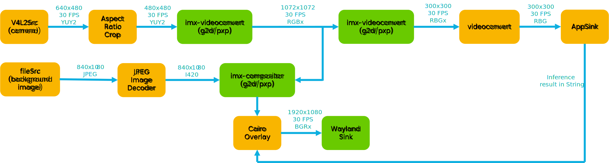
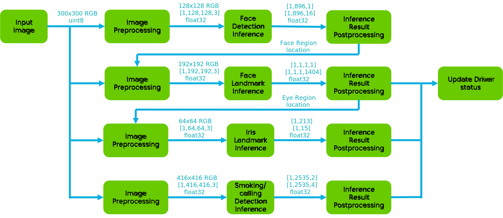
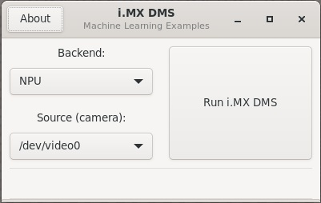
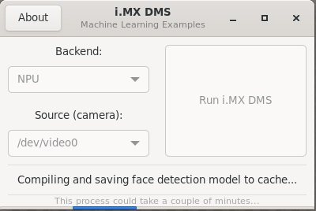
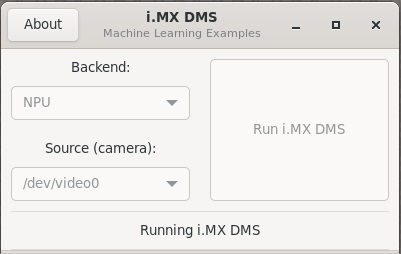
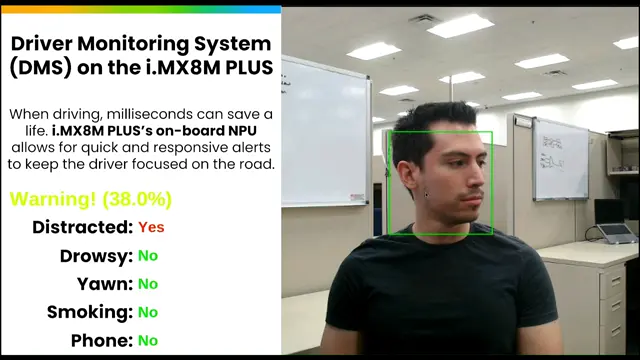
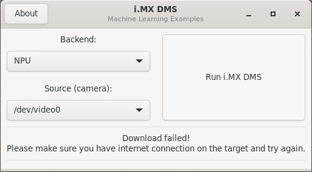
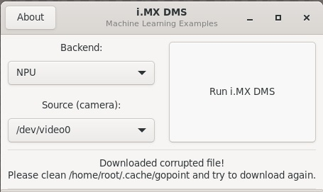

# i.MX Driver Monitor System

<!----- Boards ----->

 

NXP's *GoPoint for i.MX Applications Processors* unlocks a world of possibilities. This user-friendly app launches
pre-built applications packed with the Linux BSP, giving you hands-on experience with your i.MX SoC's capabilities.
Using the i.MX8M Plus or i.MX93 EVKs you can run the included *Driver Monitor System (DMS)* application available on GoPoint
launcher as apart of the BSP flashed on to the board. For more information about GoPoint, please refer to
[GoPoint for i.MX Applications Processors User's Guide](https://www.nxp.com/docs/en/user-guide/GPNTUG.pdf).

With rapid development in automotive industry recently, *Driver Monitor System* (DMS) has become a common requirement in today's vehicle. In general, DMS is a vehicle safety system to assess the driver's alertness and warn the driver if needed, which helps to prevent traffic accident and protect driver in the first place. With *Machine Learning* (ML) and *Neural Network* (NN)'s help, DMS can now achieve very high accuracy and low latency. This GoPoint application showcases the capability of implementing DMS on i.MX8M Plus and i.MX93 platform, and the performance boost brought by *Neural Processing Unit* (NPU) on these platforms.

## Table of Contents

1. [Software Architecture](#1-software-architecture)
2. [ML Models](#2-ML-models)
3. [Hardware](#3-hardware)
4. [Setup](#4-setup)
5. [Results](#5-results)
6. [FAQs](#6-faqs) 
7. [Support](#7-support)
8. [Revision History](#8-revision-history)

## 1 Software Architecture

*i.MX Driver Monitor System* uses Gstreamer pipeline to get camera input for inference and to display the result. The simplified block diagram of the pipeline is shown below.

>**NOTE:** On the i.MX93, *PXP* acceleration is used for the color space conversion and image resizing during pre-processing and display composition. On i.MX8M Plus, the *2D-GPU* accelerator is used for the same purpose.

When a new frame reaches *AppSink*, the following inference process will start to run using the *tflite_runtime* framework and NPU delegate, and finally return the driver status to be rendered on the display.

## 2 ML Models

*i.MX Driver Monitor System* uses four ML models in total to achieve face detection, capturing face landmark and iris landmark, smoking detection and calling detection. More details about each model is listed below.

### MediaPipe BlazeFace Short Range (Face Detection)

Information          | Value
---                  | ---
Input shape          | RGB image [1, 128, 128, 3]
Input value range    | [-1.0, 1.0]
Output shape         | Undecoded face bboxes' location: [1, 896, 16]   Scores of detected bboxes: [1, 896, 1]
MACs                 | 31.294 M
File size (INT8)     | 129 KB
Source framework     | [MediaPipe](https://developers.google.com/mediapipe/) (TensorFlow Lite)
Origin               | https://storage.googleapis.com/mediapipe-assets/face_detection_short_range.tflite

### MediaPipe Face Mesh (Face Landmark)

Information          | Value
---                  | ---
Input shape          | RGB image [1, 192, 192, 3]
Input value range    | [-1.0, 1.0]
Output shape         | 468 face landmark points' location: [1, 1, 1, 1404]   Scores of face landmark prediction: [1, 1, 1, 1]
MACs                 | 35.617 M
File size (INT8)     | 639 KB
Source framework     | [MediaPipe](https://developers.google.com/mediapipe/) (TensorFlow Lite)
Origin               | https://storage.googleapis.com/mediapipe-assets/face_landmark.tflite

### MediaPipe Iris (Iris Landmark)

Information          | Value
---                  | ---
Input shape          | RGB image [1, 64, 64, 3]
Input value range    | [-1.0, 1.0]
Output shape         | 71 normalized eye contour landmark points' location: [1, 213]   5 normalized iris landmark points' location: [1, 15]
MACs                 | 54.054 M
File size (INT8)     | 718 KB
Source framework     | [MediaPipe](https://developers.google.com/mediapipe/) (TensorFlow Lite)
Origin               | https://storage.googleapis.com/mediapipe-assets/iris_landmark.tflite

### Smoking&Calling Detection

Information          | Value
---                  | ---
Input shape          | RGB image [1, 416, 416, 3]
Input value range    | [0.0, 1.0]
Output shape         | confidence of each class (2 classes in total) of every possible detection: [1, 2535, 2]   bboxes' location of every possible detection: [1, 2535, 4]
MACs                 | 3400.093 M
File size (INT8)     | 5.8 MB
Source framework     | [YOLOv4](https://github.com/AlexeyAB/darknet/)
Origin               | Model trained by NXP

### Benchmarks

The quantized INT8 models have been tested on i.MX8M Plus and i.MX93 using `./benchmark_model` tool. For i.MX93, INT8 models need to be compiled by vela tool first before using NPU delegate.
(see [i.MX Machine Learning User's Guide](https://www.nxp.com/docs/en/user-guide/IMX-MACHINE-LEARNING-UG.pdf) for more details).

>**NOTE:** Evaluated on BSP LF-6.6.3_1.0.0.

#### MediaPipe BlazeFace Short Range performance

Platform    | Accelerator     | Avg. Inference Time | Command
---         | ---             | ---                 | ---
i.MX8M Plus | CPU (1 thread)  | 16.372 ms           | ./benchmark_model --graph=face_detection_ptq.tflite
i.MX8M Plus | CPU (4 threads) |  6.991 ms           | ./benchmark_model --graph=face_detection_ptq.tflite --num_threads=4
i.MX8M Plus | NPU             |  1.194 ms           | ./benchmark_model --graph=face_detection_ptq.tflite --external_delegate_path=/usr/lib/libvx_delegate.so
i.MX93      | CPU (1 thread)  | 10.312 ms           | ./benchmark_model --graph=face_detection_ptq.tflite
i.MX93      | CPU (2 threads) |  7.308 ms           | ./benchmark_model --graph=face_detection_ptq.tflite --num_threads=2
i.MX93      | NPU             |  1.970 ms           | ./benchmark_model --graph=face_detection_ptq_vela.tflite --external_delegate_path=/usr/lib/libethosu_delegate.so

#### MediaPipe Face Mesh performance

Platform	  | Accelerator	    | Avg. Inference Time | Command
---         | ---             | ---                 | ---
i.MX8M Plus | CPU (1 thread)  | 55.329 ms           | ./benchmark_model --graph=face_landmark_ptq.tflite
i.MX8M Plus | CPU (4 threads) | 45.820 ms           | ./benchmark_model --graph=face_landmark_ptq.tflite --num_threads=4
i.MX8M Plus | NPU             |  4.254 ms           | ./benchmark_model --graph=face_landmark_ptq.tflite --external_delegate_path=/usr/lib/libvx_delegate.so
i.MX93      | CPU (1 thread)  | 48.950 ms           | ./benchmark_model --graph=face_landmark_ptq.tflite
i.MX93      | CPU (2 threads) | 45.444 ms           | ./benchmark_model --graph=face_landmark_ptq.tflite --num_threads=2
i.MX93      | NPU             |  2.893 ms           | ./benchmark_model --graph=face_landmark_ptq_vela.tflite --external_delegate_path=/usr/lib/libethosu_delegate.so

#### MediaPipe Iris performance

Platform	  | Accelerator	    | Avg. Inference Time | Command
---         | ---             | ---                 | ---
i.MX8M Plus | CPU (1 thread)  | 51.372 ms           | ./benchmark_model --graph=iris_landmark_ptq.tflite
i.MX8M Plus | CPU (4 threads) | 40.801 ms           | ./benchmark_model --graph=iris_landmark_ptq.tflite --num_threads=4
i.MX8M Plus | NPU             |  3.412 ms           | ./benchmark_model --graph=iris_landmark_ptq.tflite --external_delegate_path=/usr/lib/libvx_delegate.so
i.MX93      | CPU (1 thread)  | 42.433 ms           | ./benchmark_model --graph=iris_landmark_ptq.tflite
i.MX93      | CPU (2 threads) | 40.587 ms           | ./benchmark_model --graph=iris_landmark_ptq.tflite --num_threads=2
i.MX93      | NPU             |  2.136 ms           | ./benchmark_model --graph=iris_landmark_ptq_vela.tflite --external_delegate_path=/usr/lib/libethosu_delegate.so

#### Smoking&Calling Detection performance

Platform	  | Accelerator	    | Avg. Inference Time | Command
---         | ---             | ---                 | ---
i.MX8M Plus | CPU (1 thread)  |  883.531 ms         | ./benchmark_model --graph=yolov4_tiny_smk_call.tflite
i.MX8M Plus | CPU (4 threads) |  371.685 ms         | ./benchmark_model --graph=yolov4_tiny_smk_call.tflite --num_threads=4
i.MX8M Plus | NPU             |  18.367 ms          | ./benchmark_model --graph=yolov4_tiny_smk_call.tflite --external_delegate_path=/usr/lib/libvx_delegate.so
i.MX93      | CPU (1 thread)  |  407.963 ms         | ./benchmark_model --graph=yolov4_tiny_smk_call.tflite
i.MX93      | CPU (2 threads) |  303.159 ms         | ./benchmark_model --graph=yolov4_tiny_smk_call.tflite --num_threads=2
i.MX93      | NPU             |  23.008 ms          | ./benchmark_model --graph=yolov4_tiny_smk_call_vela.tflite --external_delegate_path=/usr/lib/libethosu_delegate.so

## 3 Hardware

To run *i.MX Driver Monitor System*, either the i.MX8M Plus or i.MX93 EVKs are required with their respective hardware components.

Component                                         | i.MX8M Plus        | i.MX93
---                                               | :---:              | :---:
Power Supply                                      | :white_check_mark: | :white_check_mark:
HDMI Display                                      | :white_check_mark: | :white_check_mark:
USB micro-B cable (Type-A male to Micro-B male)   | :white_check_mark: |                   
USB Type-C cable  (Type-A male to Type-C male)    |                    | :white_check_mark:
HDMI cable                                        | :white_check_mark: | :white_check_mark:
IMX-MIPI-HDMI (MIPI-DSI to HDMI adapter)          |                    | :white_check_mark:
Mini-SAS cable                                    |                    | :white_check_mark:
MIPI-CSI camera module                            | :white_check_mark: | :white_check_mark:
USB camera (optional, if no MIPI-CSI camera used) | :white_check_mark: | :white_check_mark:
Mouse                                             | :white_check_mark: | :white_check_mark:

## 4 Setup

Launch GoPoint on the board and click on the **DMS** application shown in the launcher menu. Select the **Launch Demo** button to start it. A window shows up to let the user select the inference backend and camera source to be used. Make sure a camera module is connected, ether MIPI-CSI or USB camera. Once detected and selected in the drop-down menu, start the application by clicking **Run i.MX DMS**.

When running the application on i.MX8M Plus, a warm-up time is needed for models to be ready for acceleration on the NPU. On i.MX93, the models need to be compiled using vela tool for acceleration on the Ethos-U NPU. The process is done automatically, but may take about one minute to finish on each platform. This only happens during the first time of running the application, since compiled models are stored as cache files for future use.

Once the process finishes and models are ready, the application starts right away.

## 5 Results

When *i.MX Driver Monitor System* starts running successfully, the following should be seen on the display:

1. Overall driver status and 5 detail status are displayed on the left side. Camera preview and driver face bounding box are displayed on the right side.
2. When no human face is detected in current camera frame, the overall driver status shows *Driver not found!* and 5 detail status show *N/A*. When multiple human face is detected, the face that is closest to the camera center is chosen as the driver face.
3. The overall driver status is an estimation of driver's current status based on all the detail status. When one of the dangerous status/behavior is detected in current frame, or the driver face is not found, a penalty value is added to the overall driver status score, which is shown on the right side as percentage. The higher the score, the more dangerous the driver's status is. When no dangerous status/behavior is detected in current frame, the score substract a fixed number until it recovers to zero. The text and color of overall driver status changes according to the score.
4. Each of 5 detail status is an indicator of a dangerous driving status/behavior. The judgment of each status/behavior is based on following state:

Status/Behavior	| Yes                                           | No
---             | ---                                           | --- 
Distracted      | Driver's face is facing left or right         | Driver's face is facing front
Drowsy          | Driver's eye is closed (blinking is excluded) | Driver's eye is open
Yawn            | Driver's mouth is open                        | Driver's mouth is closed
Smoking         | Cigarette is detected                         | Cigarette is not detected
Phone           | Cell Phone is detected                        | Cell Phone is not detected

## 6 FAQs

### How to exit the application

Since *i.MX Driver Monitor System* runs in full-screen size, users need to use mouse to drag the application window aside to see the GoPoint launcher window. Then select the **Stop Current Demo** button to stop it

### Application unexpectedly closed when press **Run i.MX DMS** button

This is a known issue related to GTK window. If this happens, please relaunch the application. Most of the times this does not affect the execution of the application.

### Fail to download models from server

Please make sure the internet connection is working on the board. The application requires an internet connection to download the models. If internet connection is available, please update the time and date of the board before trying to download the models again. Some servers might block the downloads for security reasons when the time and date of board is not updated. Some companies might also block their networks preventing the models to be downloaded. If this is the case, try using another connection such as a mobile device working as hotspot (Wi-Fi connection is required).

### Files are corrupted

It is possible that files get corrupted during download process due to different reasons, such as a connection shutdown. If this happens, the files won't be loaded to the application. To fix this, the easy solution is to clean the following path on the board: `/home/root/.cache/gopoint`. Remove all files and try running the application again. If lucky, the files will be downloaded successfully next time.

### Camera device not working

When wrong video device is selected as Source, or the camera device is not working, the application cannot show the display after clicking **Run i.MX DMS**. Please use command `gst-launch-1.0 -v v4l2src device=/dev/videoX ! "video/x-raw,format=YUY2,width=640,height=480" ! queue ! waylandsink window-width=640 window-height=480` to check whether camera device `/dev/videoX` is working fine.

## 7 Support

For more general technical questions, enter your questions on the [NXP Community Forum](https://community.nxp.com/)

## 8 Revision History

Version | Description                         | Date
---     | ---                                 | ---
1.0.0   | Initial release                     | March 29th 2024

## Licensing

*i.MX Driver Monitor System* is licensed under the [BSD-3-Clause License](https://spdx.org/licenses/BSD-3-Clause.html).

Models used in this application are licensed under [Apache-2.0 License](https://www.apache.org/licenses/LICENSE-2.0.html).