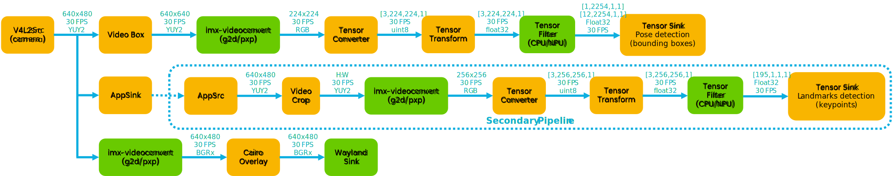
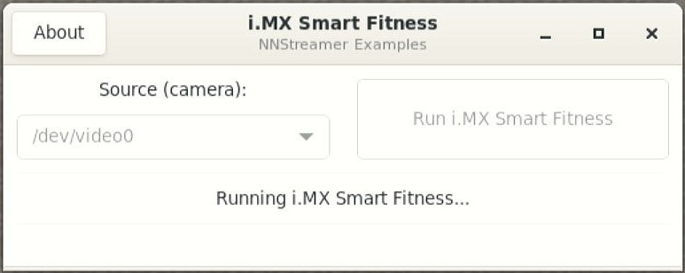
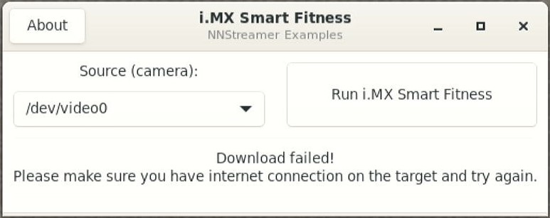

# i.MX Smart Fitness

<!----- Boards ----->

 

NXP's *GoPoint for i.MX Applications Processors* unlocks a world of possibilities. This user-friendly app launches
pre-built applications packed with the Linux BSP, giving you hands-on experience with your i.MX SoC's capabilities.
Using the i.MX8M Plus or i.MX93 EVKs you can run the included *i.MX Smart Fitness* application available on GoPoint
launcher as apart of the BSP flashed on to the board. For more information about GoPoint, please refer to
[GoPoint for i.MX Applications Processors User's Guide](https://www.nxp.com/docs/en/user-guide/GPNTUG.pdf?_gl=1*gz87wm*_ga*ODQxOTk0OTQwLjE3MDQ5ODk3NzA.*_ga_WM5LE0KMSH*MTcwNDk4OTc2OS4xLjEuMTcwNDk4OTgyOS4wLjAuMA..).

[*i.MX Smart Fitness*](https://github.com/nxp-imx-support/imx-smart-fitness) showcases the *Machine Learning* (ML)
capabilities of i.MX SoCs by using a *Neural Processing Unit* (NPU) to accelerate two Deep Learning vision-based models.
Together, these models detect a person present in the scene and predict 33 3D-keypoints to generate a complete body landmark,
known as pose estimation. From the pose estimation, a K-NN pose classifier classifies two different body poses:
'*Squat-Down*' and '*Squat-Up*'. The application tracks the 'squats' fitness exercise and the repetition counter is set
to 12 repetitions in an infinite loop.

This application is developed using GStreamer and NNStreamer. On the i.MX93, *PXP* acceleration is used for the color
space conversion and frame resizing during pre-processing and post-processing of data. On i.MX8M Plus, the *2D-GPU*
accelerator is used for the same purpose.

## Implementation using GStreamer and NNStreamer

>**NOTE:** This block diagram is simplified and do not represent the complete GStreamer + NNStreamer pipeline elements. Some elements
were omitted and only the key elements are shown.

Two GStreamer + NNStreamer pipelines are used in this application. The main pipeline captures the input video frames
from the camera, detects the human pose present in the scene and prints the pose detections and landmark keypoints on
the display. When a pose is detected, the main pipeline sends the input frame together with the bounding box
coordinates to the secondary pipeline through an `appsink` element. The secondary pipeline detects the pose landmark
keypoints whenever a pose is detected. When no pose is detected, the main pipeline does not send any frame to the
secondary pipeline and no inference is done for landmark detection. Secondary pipeline receives the input frames
through an `appsrc` element synchronized with the primary pipeline. Below is a simplified block diagram of the
pipeline.

### Main Pipeline

* Captures video from camera
* Runs pose detection model
* Overlays detection on top of video before display
* Schedules secondary pipeline execution

### Secondary Pipeline

* Uses input from main pipeline: video frame and pose detection results
* Is scheduled once per pose detected
* Crops video for detected poses in video stream
* Runs second ML model inference on cropped video

## Table of Contents
1. [Software](#1-software)
2. [Hardware](#2-hardware)
3. [Setup](#3-setup)
4. [Results](#4-results)
5. [FAQs](#5-faqs) 
6. [Support](#6-support)
7. [Release Notes](#7-release-notes)

## 1 Software

*i.MX Smart Fitness* is part of Linux BSP available at [Embedded Linux for i.MX Applications Processors](https://www.nxp.com/design/design-center/software/embedded-software/i-mx-software/embedded-linux-for-i-mx-applications-processors:IMXLINUX). All the required software and dependencies to run this
application are already included in the BSP.

i.MX Board          | Main Software Components
---                 | ---
**i.MX8M Plus EVK** | GStreamer + NNStreamer VX Delegate (NPU)     
**i.MX93 EVK**      | GStreamer + NNStreamer Ethos-U Delegate (NPU)

### Models information

#### BlazePose Detector

Information          | Value
---                  | ---
Input shape          | RGB image [1, 224, 224, 3]
Input value range    | [-1.0, 1.0]
Output shape         | Undecoded face bboxes location and keypoints: [1, 2254, 12]   Scores of detected bboxes: [1,2254,1]
MACs                 | 433.535 M
File size (INT8)     | 3.5 MB
Source framework     | MediaPipe (TensorFlow Lite)
Target platform      | MPUs

#### BlazePose GHUM 3D Lite

Information          | Value
---                  | ---
Input shape          | RGB image [1, 256, 256, 3]
Input value range    | [0.0, 1.0]
Output shape         | Pose Landmarks: [1, 195]   Presence of pose: [1, 1]   Segmentation mask for pose: [1, 256, 256, 1]   Heat map for pose: [1, 64, 64, 39]   World landmarks for pose: [1, 117]
MACs                 | 202.980 M
File size (INT8)     | 1.8 MB
Source framework     | MediaPipe (TensorFlow Lite)
Target platform      | MPUs

### Benchmarks

The quantized INT8 models have been tested on i.MX8M Plus and i.MX93 using `./benchmark_model` tool
(see [i.MX Machine Learning User's Guide](https://www.nxp.com/docs/en/user-guide/IMX-MACHINE-LEARNING-UG.pdf)).

#### BlazePose performance

Platform    | Accelerator     | Avg. latency | Command
---         | ---             | ---          | ---
i.MX8M Plus | CPU (1 thread)  | 170.23 ms    | ./benchmark_model --graph=pose_detection_quant.tflite
i.MX8M Plus | CPU (4 threads) |  67.36 ms    | ./benchmark_model --graph=pose_detection_quant.tflite --num_threads=4
i.MX8M Plus | NPU             |   8.29 ms    | ./benchmark_model --graph=pose_detection_quant.tflite --external_delegate_path=/usr/lib/libvx_delegate.so
i.MX93      | CPU (1 thread)  | 104.24 ms    | ./benchmark_model --graph=pose_detection_quant.tflite
i.MX93      | CPU (2 threads) |  70.97 ms    | ./benchmark_model --graph=pose_detection_quant.tflite --num_threads=2
i.MX93      | NPU             |   7.21 ms    | ./benchmark_model --graph=pose_detection_quant_vela.tflite --external_delegate_path=/usr/lib/libethosu_delegate.so

#### BlazePose GHUM 3D Lite performance

Platform    | Accelerator     | Avg. latency | Command
---         | ---             | ---          | ---
i.MX8M Plus | CPU (1 thread)  | 161.58 ms    | ./benchmark_model --graph=pose_landmark_lite_quant.tflite
i.MX8M Plus | CPU (4 threads) |  78.34 ms    | ./benchmark_model --graph=pose_landmark_lite_quant.tflite --num_threads=4
i.MX8M Plus | NPU             |  16.48 ms    | ./benchmark_model --graph=pose_landmark_lite_quant.tflite --external_delegate_path=/usr/lib/libvx_delegate.so
i.MX93      | CPU (1 thread)  | 116.42 ms    | ./benchmark_model --graph=pose_landmark_lite_quant.tflite
i.MX93      | CPU (2 threads) |  84.69 ms    | ./benchmark_model --graph=pose_landmark_lite_quant.tflite --num_threads=2
i.MX93      | NPU             |  9.83 ms     | ./benchmark_model --graph=pose_landmark_lite_quant_vela.tflite --external_delegate_path=/usr/lib/libethosu_delegate.so

>**NOTE:** Evaluated on BSP LF-6.6.3_1.0.0.

>**NOTE:** If you are building the BSP using Yocto Project instead of downloading the pre-built BSP, make sure
the BSP is built for *imx-image-full*, otherwise GoPoint is not included. Machine learning software is only
available in *imx-image-full*.

## 2 Hardware

To test *i.MX Smart Fitness*, either the i.MX8M Plus or i.MX93 EVKs are required with their respective hardware components.

Component                                         | i.MX8M Plus        | i.MX93
---                                               | :---:              | :---:
Power Supply                                      | :white_check_mark: | :white_check_mark:
HDMI Display                                      | :white_check_mark: | :white_check_mark:
USB micro-B cable (Type-A male to Micro-B male)   | :white_check_mark: |                   
USB Type-C cable  (Type-A male to Type-C male)    |                    | :white_check_mark:
HDMI cable                                        | :white_check_mark: | :white_check_mark:
IMX-MIPI-HDMI (MIPI-DSI to HDMI adapter)          |                    | :white_check_mark:
Mini-SAS cable                                    |                    | :white_check_mark:
MIPI-CSI camera module                            | :white_check_mark: | :white_check_mark:
USB camera (optional, if no MIPI-CSI camera used) | :white_check_mark: | :white_check_mark:
Mouse                                             | :white_check_mark: | :white_check_mark:

## 3 Setup

Launch GoPoint on the board and click on the *i.MX Smart Fitness* application shown in the launcher menu. Select 
the **Launch Demo** button to start it. A window shows up to let the user select the camera source to be used.
Make sure a camera module is connected, ether MIPI-CSI or USB camera. Once detected and selected in the drop-down
menu, start the application by clicking **Run i.MX Smart Fitness**.

 

When running the *i.MX Smart Fitness* application on i.MX8M Plus, a warm-up time is needed for models to be ready
for acceleration on the NPU. On i.MX93, the models are compiled using vela compiler for Ethos-U NPU acceleration.
The process is done automatically, but takes a couple of minutes on each board. Once the process finishes and models
are ready, the application starts right away. This only happens during first time running the application, since
compiled models are stored on the cache for future use.

## 4 Results

When *i.MX Smart Fitness* starts running the following is seen on display:

1. Video information displayed at the top left corner showing total rendered frames, dropped frames, current frames
per second (FPS) and Avg. FPS. Below is the avg. inference time of both ML models.
2. The counter of squats done by the person present in the scene, shown at the top right corner. This counter starts at
zero and goes up to twelve. Every twelve repetitions the counter resets to zero.
3. Classified poses are shown at the bottom corners: `Squat-Up` and `Squat-Down`. These will change color between green
and red depending on which pose is being detected.
4. The bounding box for the detected human pose. Make sure the person standing in front of camera is completely visible
in the scene, otherwise the landmarks will not be computed. If the person is not completely seen by the camera and stands
in the center of the scene, the bounding box is red, meaning the person needs to move. If the pose es correctly detected,
the bounding box is green. This will allow the computation of landmarks.
5. When the human pose is correctly detected and the bounding box is green, the 33 landmarks are shown ontop of the human pose.
These landmarks are used by the K-NN classifier to decide if the person is squating or not.

## 5 FAQs

### Is the source code of i.MX Smart Fitness available?

Yes, the source code is available under the [Apache-2.0 License](https://www.apache.org/licenses/LICENSE-2.0) at
https://github.com/nxp-imx-support/imx-smart-fitness. There is more information on how to cross-compile the
application for stand-alone deployment, as well as how to generate the quantized models.

### The GTK+3 GUI windows close unexpectedly when running the application

This is a known issue and we are working on it. Sometimes the windows close unexpectedly. If this happens,
please relaunch the application. Most of the times this does not affect the execution of the application.

### Models are failing to download from server

Please make sure the internet connection is up and running on the board. The application requires an internet connection
to download the models. If internet connection is available, please update the time and date of the board before
trying to download the models again. Some servers might block the downloads for security reasons when the time and date
of board is not updated. Some companies might also block their networks preventing the models to be downloaded; if
this is the case, try using another connection such as a mobile device working as hotspot (Wi-Fi connection is required).

### Files are corrupted

It is possible that files get corrupted during download process due to different reasons, such as a connection shutdown.
If this happens, the files won't be loaded to the application. To fix this, the easy solution is to clean the following
path on the board: `/home/root/.cache/gopoint`. Remove all files and try running the application again. If lucky, the
files will be downloaded successfully next time.

### Device not compatible or not working

This is caused if the camera being used is not correctly selected in the drop-down menu list. Try selecting another
source.

## 6 Support

Questions regarding the content/correctness of this example can be entered as Issues within this GitHub repository.

>**Warning**: For more general technical questions, enter your questions on the [NXP Community Forum](https://community.nxp.com/)

## 7. Release Notes

Version | Description                         | Date
---     | ---                                 | ---
1.0.0   | Initial release                     | March 29th 2024
 

## Licensing

*i.MX Smart Fitness* is licensed under the [Apache-2.0 License](https://www.apache.org/licenses/LICENSE-2.0).

## Origin

[1] BlazePose: On-device Real-time Body Pose tracking, CVPR Workshop on Computer Vision for Augmented and Virtual
Reality, Seattle, WA, USA, 2020.

[2] GHUM & GHUML: Generative 3D Human Shape and Articulated Pose Models Proceedings of the IEEE/CVF Conference on
Computer Vision and Pattern Recognition, pages 6184-6193, 2020.

Models created by: Valentin Bazarevsky, Google; Ivan Grishchenko, Google; Eduard Gabriel Bazavan, Google.

Model card: https://storage.googleapis.com/mediapipe-assets/Model%20Card%20BlazePose%20GHUM%203D.pdf

MediaPipe models are licensed under [Apache-2.0 License](https://www.apache.org/licenses/LICENSE-2.0.html).