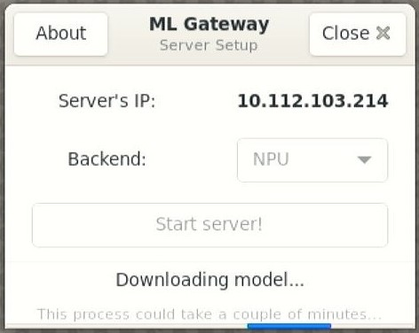

# ML Gateway

<!----- Boards ----->

NXP's *GoPoint for i.MX Applications Processors* unlocks a world of possibilities. This user-friendly app launches
pre-built applications packed with the Linux BSP, giving you hands-on experience with your i.MX SoC's capabilities.
Using the i.MX8M Plus or i.MX93 EVKs together with i.MX8M Mini EVK you can run the included *ML Gateway* application
for object detection use case. *ML Gateway* is available on GoPoint launcher as apart of the BSP flashed on to the
board. For more information about GoPoint, please visit [GoPoint User's Guide](https://www.nxp.com/docs/en/user-guide/GPNTUG.pdf?_gl=1*gz87wm*_ga*ODQxOTk0OTQwLjE3MDQ5ODk3NzA.*_ga_WM5LE0KMSH*MTcwNDk4OTc2OS4xLjEuMTcwNDk4OTgyOS4wLjAuMA..).

*ML Gateway* allows devices with limited *Machine Learning* (ML) processing power to use the resources of another much more
powerful device to accelerate their ML inferences. This application configures the i.MX8M Plus or i.MX93 EVKs as
servers, allowing other devices such as the i.MX8M Mini EVK to connect and use their *Neural Processing Unit* (NPU) for
ML acceleration. Also, the server broadcasts its IP address so clients can connect to the *ML Gateway* effortlessly.
This application was developed based on the following Application Note: [AN13650](https://www.nxp.com/webapp/Download?colCode=AN13650).

## NNStreamer::tensor_query

>**NOTE:** These block diagrams are simplified and do not represent the complete GStreamer + NNStreamer pipeline elements. Some elements
were omitted and only the key elements are shown.

The [tensor_query](https://github.com/nnstreamer/nnstreamer/tree/main/gst/nnstreamer/tensor_query#nnstreamertensor_query)
plugin allows devices that have weak ML computational power to use resources from higher-performance devices. Consider a
network of lightweight devices (i.MX 8M Mini, i.MX 8M Nano, etc.) connected to an embedded device with sufficient compute
power (i.MX8M Plus, i.MX93). This way, any client can ask the server to handle heavy ML tasks and receive the results from
it. Since i.MX8M Plus and i.MX93 both contain an NPU, these SoCs can be configured as servers [1].

 

## Table of Contents
1. [Software](#1-software)
2. [Hardware](#2-hardware)
3. [Setup](#3-setup)
4. [Results](#4-results)
5. [FAQs](#5-faqs) 
6. [Support](#6-support)
7. [Release Notes](#7-release-notes)

## 1 Software

*ML Gateway* is part of Linux BSP available at [Embedded Linux for i.MX Applications Processors](https://www.nxp.com/design/design-center/software/embedded-software/i-mx-software/embedded-linux-for-i-mx-applications-processors:IMXLINUX). All the required software and dependencies to run this application
are already included in the BSP.

i.MX Board          | Main Software Components
---                 | ---
**i.MX8M Plus EVK** | GStreamer + NNStreamer VX Delegate (NPU)     
**i.MX93 EVK**      | GStreamer + NNStreamer Ethos-U Delegate (NPU)
**i.MX8M Mini EVK** | GStreamer + NNStreamer 

The pre-processing and post-processing of data is done completely on the client side. For this application, the client
is running on the i.MX8M Mini EVK, so frame resizing and conversion is done using the 2D-GPU for acceleration.

### Benchmarks

The quantized INT8 models have been tested on i.MX using `./benchmark_model` tool
(see [i.MX Machine Learning User's Guide](https://www.nxp.com/docs/en/user-guide/IMX-MACHINE-LEARNING-UG.pdf)).

#### Benchmarks for object detection model running on servers

Platform    | Accelerator     | Avg. latency | Command
---         | ---             | ---          | ---
i.MX8M Plus | CPU (1 thread)  | 247.81 ms    | ./benchmark_model --graph=mobilenet_ssd_v2_coco_quant_postprocess.tflite
i.MX8M Plus | CPU (4 threads) |  73.96 ms    | ./benchmark_model --graph=mobilenet_ssd_v2_coco_quant_postprocess.tflite --num_threads=4
i.MX8M Plus | NPU             |  11.20 ms    | ./benchmark_model --graph=mobilenet_ssd_v2_coco_quant_postprocess.tflite --external_delegate_path=/usr/lib/libvx_delegate.so
i.MX93      | CPU (1 thread)  | 111.79 ms    | ./benchmark_model --graph=mobilenet_ssd_v2_coco_quant_postprocess.tflite
i.MX93      | CPU (2 threads) |  65.89 ms    | ./benchmark_model --graph=mobilenet_ssd_v2_coco_quant_postprocess.tflite --num_threads=2
i.MX93      | NPU             |  12.70 ms    | ./benchmark_model --graph=mobilenet_ssd_v2_coco_quant_postprocess_vela.tflite --external_delegate_path=/usr/lib/libethosu_delegate.so

#### Benchmark for object detection model running on client's Cortex-A (i.MX8M Mini EVK)

Platform    | Accelerator     | Avg. latency | Command
---         | ---             | ---          | ---
i.MX8M Plus | CPU (1 thread)  | 261.88 ms    | ./benchmark_model --graph=mobilenet_ssd_v2_coco_quant_postprocess.tflite
i.MX8M Plus | CPU (4 threads) |  77.28 ms    | ./benchmark_model --graph=mobilenet_ssd_v2_coco_quant_postprocess.tflite --num_threads=4

>**NOTE:** Evaluated on BSP LF-6.6.3_1.0.0.

>**NOTE:** If you are building the BSP using Yocto Project instead of downloading the pre-built BSP, make sure the BSP
is built for *imx-image-full*, otherwise GoPoint is not included. Machine learning software is only available in
*imx-image-full*.

## 2 Hardware

To test *ML Gateway*, the i.MX8M Mini EVK and i.MX8M Plus or i.MX93 EVKs are required. The i.MX8M Plus or i.MX93 EVKs are
used as servers, running an NNStreamer pipeline to collect data from client and process it, returning the results back
to the client. The i.MX8M Mini EVK will be used as client interpreting the results from the *ML Gateway* and shows them
on the display. This application requires at least two devices (1 server and 1 client), both connected over an internet
connection.

Component                                         | i.MX8M Plus        | i.MX93             | i.MX8M Mini
---                                               | :---:              | :---:              | :---:
Power Supply                                      | :white_check_mark: | :white_check_mark: | :white_check_mark:
HDMI Display                                      | :white_check_mark: | :white_check_mark: | :white_check_mark:
Ethernet cable                                    | :white_check_mark: | :white_check_mark: | :white_check_mark:
USB micro-B cable (Type-A male to Micro-B male)   | :white_check_mark: |                    | :white_check_mark:
USB Type-C cable  (Type-A male to Type-C male)    |                    | :white_check_mark: |
HDMI cable                                        | :white_check_mark: | :white_check_mark: | :white_check_mark:
IMX-MIPI-HDMI (MIPI-DSI to HDMI adapter)          |                    | :white_check_mark: | :white_check_mark:
Mini-SAS cable                                    |                    | :white_check_mark: | :white_check_mark:
MIPI-CSI camera module                            |                    |                    | :white_check_mark:
USB camera (optional, if no MIPI-CSI camera used) |                    |                    | :white_check_mark:
Mouse                                             | :white_check_mark: | :white_check_mark: | :white_check_mark:

>**NOTE:** You do not need both i.MX8M Plus and i.MX93. Choose one to work as the ML Gateway server.

## 3 Setup

Launch GoPoint on the board that will be used as server, i.e., i.MX8M Plus or i.MX93 EVK (both have NPU), and click on
the *ML Gateway* application shown in the launcher menu. Select the **Launch Demo** button to start *ML Gateway*, which
will automatically detect the board to be configured as server. It starts downloading the model to be used for object
detection task. Wait until says “*Model is ready for inference!*”. If model failed to download, please check your
internet connection.

 

###  Start the server

The server board will show its current IP address in the GUI. By selecting the appropriate option from the dropdown,
the server allows users to choose whether to perform inferences on the NPU or the CPU. It is expected to use the NPU,
but user could test on CPU to compare the inference performance when ML model is not accelerated by NPU. When ready,
click the **Start Server!** button. If the server is set up successfully, the **Server is running** gets displayed.

  

### Connect client and start inference

When setting up a client, the device looks for a server IP and, if found, displays it as an option to pick in the
window. Users can also type in their custom IP address if for some reason it is not detected by the client. Please make
sure the camera source is selected for the correct device. When ready, click on the **Connect to Server** button. The
device connects to the server and displays a video output with the detected objects.

 

>**NOTE:** Sometimes the first time running the application on the client will cause some latency seen in the bounding
boxes being detected. This might happen only when server is configured on the i.MX8M Plus EVK, which needs a warming-up
time to load the ML model. If this occurs, please stop the client process and connect again to the server. This will
most probably fix the latency issue and bounding boxes should be shown in real time on second run.

## 4 Results

When *ML Gateway* starts running on a client, a video overlay with the following information is shown:
1. Class name of the detected objects and corresponding bounding boxes.
2. Total rendered frames, dropped frames, current frames per second (FPS) and Avg. FPS.

 

## 5 FAQs

### I see some latency added to the detected bounding boxes on client side (i.MX8M Mini EVK)

If the server is running on the i.MX8M Plus EVK, the first time the i.MX8M Mini connects to it and starts running
might result in some latency added to the detection of bounding boxes. This is due to the warm-up time needed by
the NPU together with the synchronization process between client and server pipelines. Please try stopping the
client process and then reconnect to the server. Second try should fix this issue. Do not stop the server when fixing
this, leave it running, so client re-connects to it when already working. This issue has not been seen on i.MX93
server, but if it happens, advice is to to the same.

### When I try to connect the client to the server, I see the following error: "Internal data stream error!"

This issue is most probably caused when selecting an unsupported camera source. Please try changing the camera device
in de source drop-down menu and this issue should be fixed when the correct device is selected.

 

### The IP server address is not seen on the client window

Please make sure the server process is running on the ML Gateway EVK (i.MX8M Plus or i.MX93) and both the client and
server EVKs are connected to the same network, so they can be seen by each other. If this is not the case, the IP
address will not be seen on the i.MX8M Mini EVK. If you already confirmed that both EVKs are connected to the same
network and the server process is running, you could try typing in the server's IP address in the text box on the
i.MX8M Mini. The command to get the IP address on the server is `ip addr` and must be typed in in the server
command line console. If this does not fix the issue, then it is possible that the client cannot reach out to the server
due to networking setup configurations. You can try to ping the server by using `ping <ip_address_server>` from the
client command line console and confirm if ping is successfull or not.

 

### When I click on "Launch Demo" the ML Gateway application does not start

This is a known issue and the solution is to make sure the board has internet connection, otherwise it won't start. This
will be fixed in future releases.

### I get "Corrupted file!" message when running the application

It is possible that files get corrupted during download process due to different reasons, such as a connection shutdown.
If this happens, the files won't be loaded to the application. To fix this, the easy solution is to clean the following
path on the board: `/home/root/.cache/gopoint`. Remove all files and try running the application again. If lucky, the
files will be downloaded successfully next time.

 

## 6 Support

Questions regarding the content/correctness of this example can be entered as Issues within this GitHub repository.

>**Warning**: For more general technical questions, enter your questions on the [NXP Community Forum](https://community.nxp.com/)

## 7 Release Notes

Version | Description                         | Date
---     | ---                                 | ---
 2.0.0  | Refactored *ML Gateway* application | March 29th 2024

## Licensing

*ML Gateway* is licensed under the [Apache-2.0 License](https://www.apache.org/licenses/LICENSE-2.0).

## Origin

[1] *NNStreamer::tensor_query* available at: https://github.com/nnstreamer/nnstreamer/tree/main/gst/nnstreamer/tensor_query#nnstreamertensor_query
