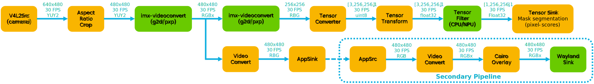
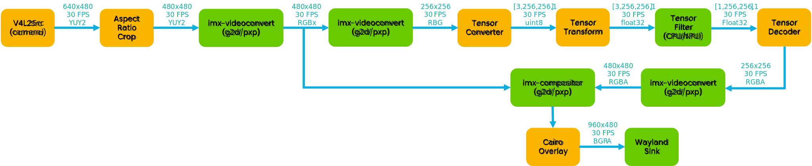
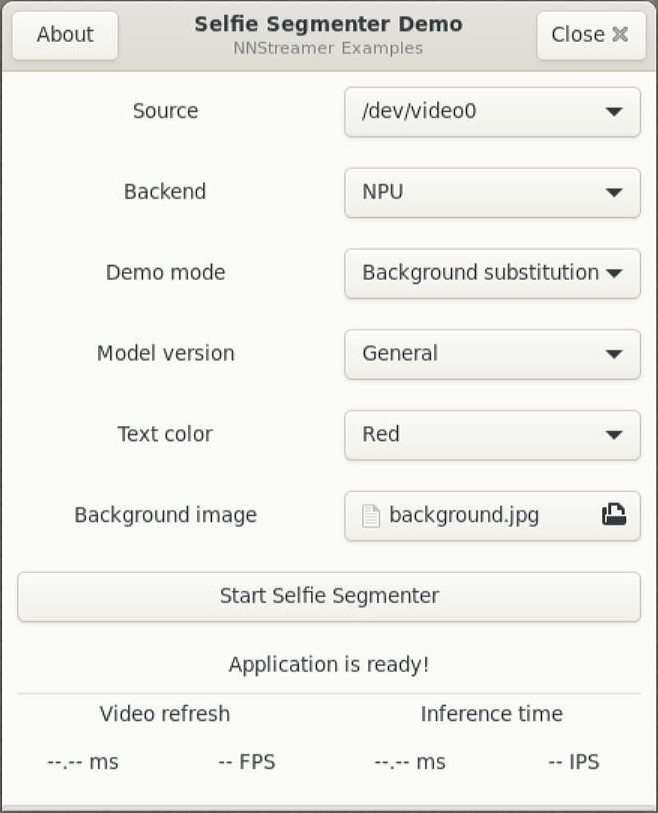
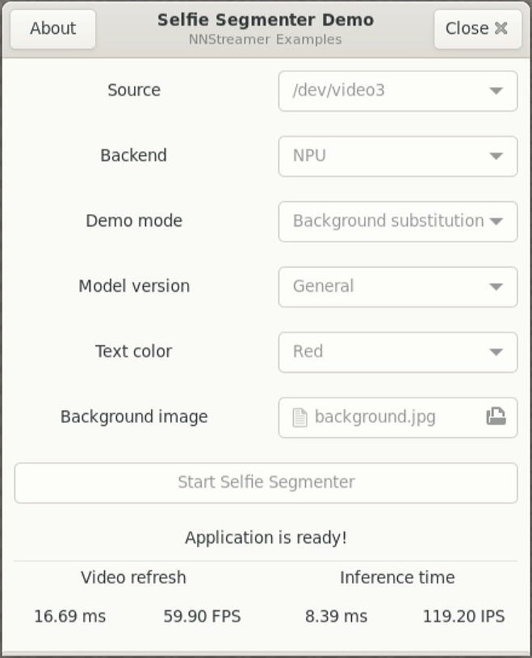
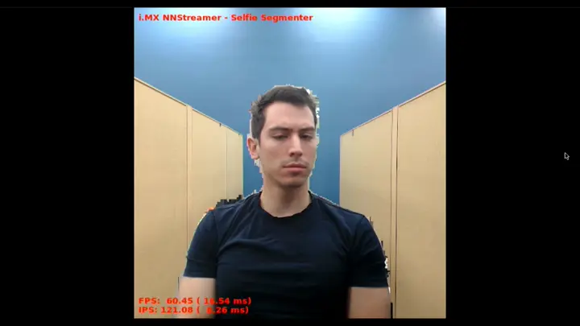
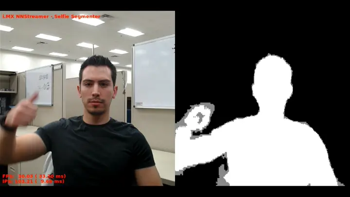
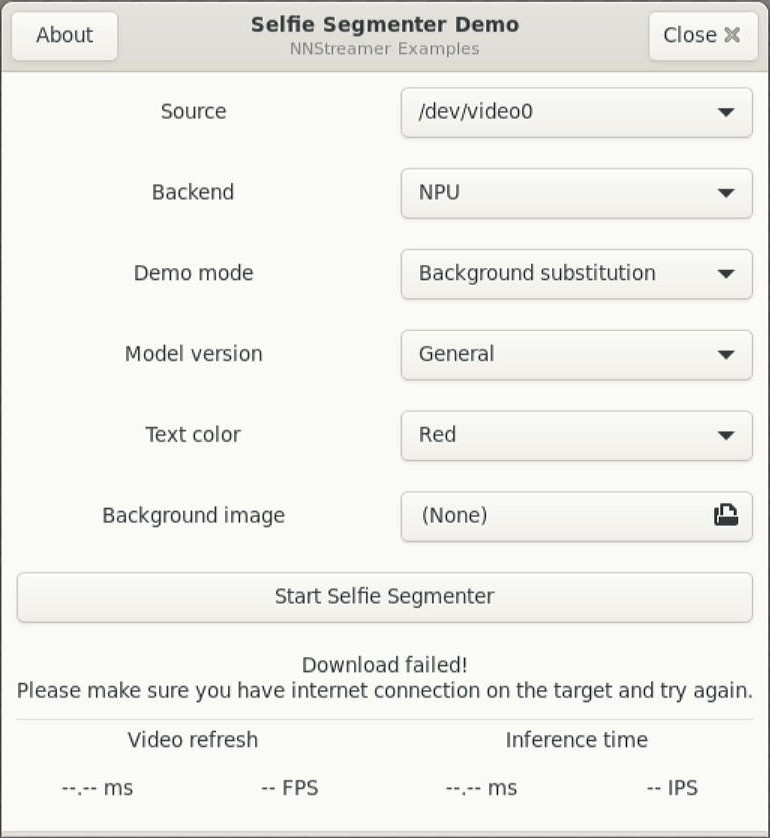
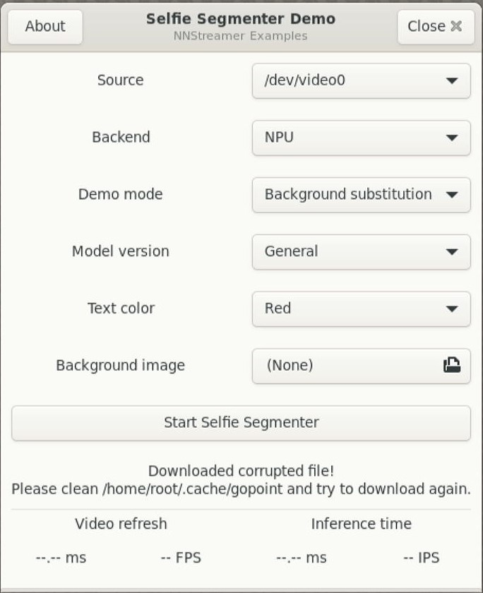
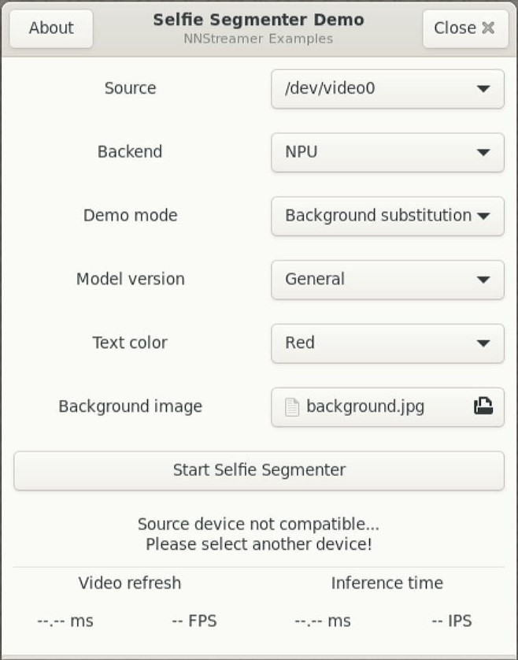

# Selfie Segmenter

<!----- Boards ----->

 
 

NXP's *GoPoint for i.MX Applications Processors* unlocks a world of possibilities. This user-friendly app launches
pre-built applications packed with the Linux BSP, giving you hands-on experience with your i.MX SoC's capabilities.
Using the i.MX8M Plus or i.MX93 EVKs you can run the included *Selfie Segmenter* application available on GoPoint
launcher as apart of the BSP flashed on to the board. For more information about GoPoint, please refer to
[GoPoint for i.MX Applications Processors User's Guide](https://www.nxp.com/docs/en/user-guide/GPNTUG.pdf?_gl=1*gz87wm*_ga*ODQxOTk0OTQwLjE3MDQ5ODk3NzA.*_ga_WM5LE0KMSH*MTcwNDk4OTc2OS4xLjEuMTcwNDk4OTgyOS4wLjAuMA..).

*Selfie Segmenter* showcases the *Machine Learning* (ML) capabilities of i.MX SoCs by using a *Neural Processing Unit* (NPU)
to accelerate an instance segmentation model. This model lets you segment the portrait of a person and can be used to
replace or modify the background of an image. Its architecture is based on MobileNetV3 with added customized decoder blocks
for segmentation. There are two versions of the same model: *general* [256x256x3] and *landscape* [144x256x3]. The general
version of this model is more accurate than the landscape version due to its bigger input size, thus more
features can be extracted. The landscape version runs faster and achieves real-time performance in both CPU
(XNNPack delegate) or NPU (VX Delegate and Ethos-U Delegate).

This application is developed using GStreamer and NNStreamer. On the i.MX93, *PXP* acceleration is used for the color
space conversion and frame resizing during pre-processing and post-processing of data. On i.MX8M Plus, the *2D-GPU*
accelerator is used for the same purpose.

## Implementation using GStreamer and NNStreamer

>**NOTE:** These block diagrams are simplified and do not represent the complete GStreamer + NNStreamer pipeline elements. Some elements
were omitted and only the key elements are shown. Additionally, these diagrams are for the general version of selfie segmenter model.

### Selfie Segmenter - Background substitution

This mode segments the background from the person and replace it with an image, which could, for example, represent a conference room.
The simplified block diagram for the GStreamer + NNStreamer pipeline is shown below. The main pipeline captures the input video from
the camera and feeds the frames to the selfie segmenter model. At the same time, the input frames are shared to an offline process
through an `appsink` element. These frames are processed offline using the segmentation mask predicted by the model, replacing the
background of the scene with a selected image. The replaced background frames are then feed back to the secondary pipeline through
an `appsrc` element which displays them to the monitor using Wayland.

### Selfie Segmenter - Segmentation mask

This mode shows side to side the input video and the segmentation mask predicted by the segmenter model to better show what the model's
output is. This GStreamer + NNStreamer is much simpler than the previous one, since no offline processing is required for the segmentation
mask.

## Table of Contents
1. [Software](#1-software)
2. [Hardware](#2-hardware)
3. [Setup](#3-setup)
4. [Results](#4-results)
5. [FAQs](#5-faqs) 
6. [Support](#6-support)
7. [Release Notes](#7-release-notes)

## 1 Software

*Selfie Segmenter* is part of Linux BSP available at [Embedded Linux for i.MX Applications Processors](https://www.nxp.com/design/design-center/software/embedded-software/i-mx-software/embedded-linux-for-i-mx-applications-processors:IMXLINUX). All the required software and dependencies to run this
application are already included in the BSP.

i.MX Board          | Main Software Components
---                 | ---
**i.MX8M Plus EVK** | GStreamer + NNStreamer VX Delegate (NPU)     
**i.MX93 EVK**      | GStreamer + NNStreamer Ethos-U Delegate (NPU)

### Model Information

Information          | Value (General)                 | Value (Landscape)
---                  | ---                             | ---
Input shape          | RGB image [1, 256, 256, 3]      | RGB image [1, 144, 256, 3]
Input value range    | [0.0, 1.0]                      | [0.0, 1.0]
Output shape         | Grayscale mask [1, 256, 256, 1] | Grayscale mask [1, 144, 256, 1]
Output value range   | [0.0, 1.0]                      | [0.0, 1.0]
OPS                  | 127.7 M OPS                     | 71.6 M OPS
MACs                 | 63.84 M MACs                    | 35.78 M MACs
File size (FLOAT16)  | 244 KB                          | 244 KB
File size (INT8)     | 216 KB                          | 216 KB
Source framework     | MediaPipe (TensorFlow Lite)     | MediaPipe (TensorFlow Lite)
Target platform      | MPUs                            | MPUs

For more information about these models and instructions on how to quantize them for eIQ® deployment on i.MX, please
refer to [Selfie Segmenter (MediaPipe) - eIQ® Model Zoo](https://github.com/NXP/eiq-model-zoo/tree/main/tasks/vision/semantic-segmentation/selfie-segmenter#selfie-segmenter-mediapipe).

### Benchmarks

The quantized INT8 models have been tested on i.MX8M Plus and i.MX93 using `./benchmark_model` tool
(see [i.MX Machine Learning User's Guide](https://www.nxp.com/docs/en/user-guide/IMX-MACHINE-LEARNING-UG.pdf)).

#### General model's performance

Platform    | Accelerator     | Avg. latency | Command
---         | ---             | ---          | ---
i.MX8M Plus | CPU (1 thread)  | 61.94 ms     | ./benchmark_model --graph=selfie_segmenter_int8.tflite
i.MX8M Plus | CPU (4 threads) | 32.63 ms     | ./benchmark_model --graph=selfie_segmenter_int8.tflite --num_threads=4
i.MX8M Plus | NPU             |  7.90 ms     | ./benchmark_model --graph=selfie_segmenter_int8.tflite --external_delegate_path=/usr/lib/libvx_delegate.so
i.MX93      | CPU (1 thread)  | 42.62 ms     | ./benchmark_model --graph=selfie_segmenter_int8.tflite
i.MX93      | CPU (2 threads) | 33.55 ms     | ./benchmark_model --graph=selfie_segmenter_int8.tflite --num_threads=2
i.MX93      | NPU             |  4.52 ms     | ./benchmark_model --graph=selfie_segmenter_int8_vela.tflite --external_delegate_path=/usr/lib/libethosu_delegate.so

#### Landscape model's performance

Platform    | Accelerator     | Avg. latency | Command
---         | ---             | ---          | ---
i.MX8M Plus | CPU (1 thread)  | 33.55 ms     | ./benchmark_model --graph=selfie_segmenter_landscape_int8.tflite
i.MX8M Plus | CPU (4 threads) | 17.95 ms     | ./benchmark_model --graph=selfie_segmenter_landscape_int8.tflite --num_threads=4
i.MX8M Plus | NPU             |  4.26 ms     | ./benchmark_model --graph=selfie_segmenter_landscape_int8.tflite --external_delegate_path=/usr/lib/libvx_delegate.so
i.MX93      | CPU (1 thread)  | 23.00 ms     | ./benchmark_model --graph=selfie_segmenter_landscape_int8.tflite
i.MX93      | CPU (2 threads) | 18.69 ms     | ./benchmark_model --graph=selfie_segmenter_landscape_int8.tflite --num_threads=2
i.MX93      | NPU             |  2.69 ms     | ./benchmark_model --graph=selfie_segmenter_landscape_int8_vela.tflite --external_delegate_path=/usr/lib/libethosu_delegate.so

>**NOTE:** Evaluated on BSP LF-6.6.3_1.0.0.

>**NOTE:** If you are building the BSP using Yocto Project instead of downloading the pre-built BSP, make sure
the BSP is built for *imx-image-full*, otherwise GoPoint is not included. Machine learning software is only
available in *imx-image-full*.

## 2 Hardware

To test *Selfie Segmenter*, either the i.MX8M Plus or i.MX93 EVKs are required with their respective hardware components.

Component                                         | i.MX8M Plus        | i.MX93
---                                               | :---:              | :---:
Power Supply                                      | :white_check_mark: | :white_check_mark:
HDMI Display                                      | :white_check_mark: | :white_check_mark:
USB micro-B cable (Type-A male to Micro-B male)   | :white_check_mark: |                   
USB Type-C cable  (Type-A male to Type-C male)    |                    | :white_check_mark:
HDMI cable                                        | :white_check_mark: | :white_check_mark:
IMX-MIPI-HDMI (MIPI-DSI to HDMI adapter)          |                    | :white_check_mark:
Mini-SAS cable                                    |                    | :white_check_mark:
MIPI-CSI camera module                            | :white_check_mark: | :white_check_mark:
USB camera (optional, if no MIPI-CSI camera used) | :white_check_mark: | :white_check_mark:
Mouse                                             | :white_check_mark: | :white_check_mark:

## 3 Setup

Launch GoPoint on the board and click on the *Selfie Segmenter* application shown in the launcher menu. Select 
the **Launch Demo** button to start it.

1. A window shows up to let the user select the camera source to be used. Make sure a camera module is connected, either MIPI-CSI or USB camera.
2. Choose the backend (NPU or CPU) for ML inference.
3. Two different application modes are available: *Background substitution* and *Segmentation mask*. The first one
replaces the background with a selected image and the latter shows the segmentation mask predicted by the model. Select
the one you would like to test.
4. Both the *General* and *Landscape* versions of this model can be tested. Choose the version you want.
5. If desired, change the color of the text shown in the video output.
6. For the *Background substitution* mode, the background image can be changed to any image.jpg file.
7. Start the application by clicking on **Start Selfie Segmenter**.

 

When running the *Selfie Segmenter* application on i.MX8M Plus, a warm-up time is needed for models to be ready
for acceleration on the NPU. On i.MX93, the models are compiled using vela compiler for Ethos-U65 NPU acceleration.
The process is done automatically, but takes a couple of minutes on each board. Once the process finishes and models
are ready, the application starts right away. This only happens during first time running the application, since
compiled models are stored on the cache for future use. When the application is running, the video refresh and
inference time are shown in the launcher.

## 4 Results

### Selfie Segmenter - Background substitution

When *Selfie Segmenter* is chosen for background substitution, the following is seen on display:

1. Video information displayed at the bottom left corner showing avg. frames per second (FPS) and avg. inferences
per second (IPS).
2. The background will be replaced with the default image. This image could be changed if desired.

### Selfie Segmenter - Segmentation mask

When *Selfie Segmenter* is chosen for segmentation mask, the following is seen on display:

1. Video information displayed at the bottom left corner showing avg. frames per second (FPS) and avg. inferences
per second (IPS).
2. Side to side comparison of input video and segmentation mask.

## 5 FAQs

### The GTK+3 GUI windows close unexpectedly when running the application

This is a known issue and we are working on it. Sometimes the windows close unexpectedly. If this happens,
please relaunch the application. Most of the times this does not affect the execution of the application.

### Models are failing to download from server

Please make sure the internet connection is up and running on the board. The application requires an internet connection
to download the models. If internet connection is available, please update the time and date of the board before
trying to download the models again. Some servers might block the downloads for security reasons when the time and date
of board is not updated. Some companies might also block their networks preventing the models to be downloaded; if
this is the case, try using another connection such as a mobile device working as hotspot (Wi-Fi connection is required).

### Files are corrupted

It is possible that files get corrupted during download process due to different reasons, such as a connection shutdown.
If this happens, the files won't be loaded to the application. To fix this, the easy solution is to clean the following
path on the board: `/home/root/.cache/gopoint`. Remove all files and try running the application again. If lucky, the
files will be downloaded successfully next time.

### Device not compatible or not working

This is caused if the camera being used is not correctly selected in the drop-down menu list. Try selecting another
source.

## 6 Support

Questions regarding the content/correctness of this example can be entered as Issues within this GitHub repository.

>**Warning**: For more general technical questions, enter your questions on the [NXP Community Forum](https://community.nxp.com/)

## 7. Release Notes

Version | Description                         | Date
---     | ---                                 | ---
1.0.0   | Initial release                     | March 29th 2024
 

## Licensing

*Selfie Segmenter* is licensed under the [Apache-2.0 License](https://www.apache.org/licenses/LICENSE-2.0).

## Origin

Model card: https://storage.googleapis.com/mediapipe-assets/Model%20Card%20MediaPipe%20Selfie%20Segmentation.pdf

MediaPipe Solution: https://developers.google.com/mediapipe/solutions/vision/image_segmenter

This model was created by: Tingbo Hou, Google; Siargey Pisarchyk, Google; Karthik Raveendran, Google.

MediaPipe models are licensed under [Apache-2.0 License](https://www.apache.org/licenses/LICENSE-2.0.html).